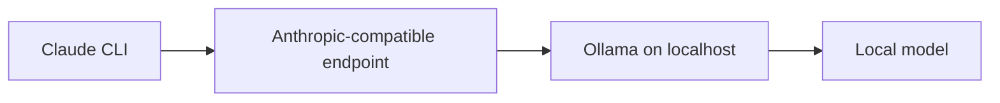

<div align="center">
  <h1>Claude-Ollama-Coder</h1>
  <p><strong>Use the Claude CLI workflow with local models served by Ollama.</strong></p>
  <p>
    <a href="https://cagricatik.github.io/claude-ollama-coder/">
      
    </a>
    <a href="https://ollama.com/">
      
    </a>
    <a href="https://docs.anthropic.com/en/docs/claude-code">
      
    </a>
    
    
  </p>
</div>

This project documents and automates a practical setup where Claude CLI is pointed at an Anthropic-compatible local endpoint backed by Ollama. The goal is to keep the Claude-style command-line workflow while running coding models locally.

## What This Is

Claude CLI normally talks to Anthropic's hosted API. In this setup, the CLI is configured to send requests to Ollama on your machine instead.



This is useful when you want:

- local inference for development work
- the Claude CLI interaction style
- local coding models such as `qwen3-coder`, `gpt-oss`, or `deepseek-coder`
- fewer external API calls during experimentation
- a documentation-first reference for Claude, Claude Code, MCP, skills, and agent workflows

## Requirements

- Windows, macOS, or Linux
- [Ollama](https://ollama.com/) installed and running
- Claude CLI installed
- At least one local model pulled in Ollama
- Python 3 for the documentation site

## Quick Start

Start Ollama:

```bash
ollama serve
```

Pull a coding model:

```bash
ollama pull qwen3-coder
```

Configure your shell for an Anthropic-compatible local endpoint:

```bash
export ANTHROPIC_BASE_URL=http://localhost:11434
export ANTHROPIC_AUTH_TOKEN=ollama
unset ANTHROPIC_API_KEY
```

Run Claude CLI:

```bash
claude --model qwen3-coder -p "Explain this repository"
```

On Windows, you can use the included helper script:

```bat
run-claude.bat
```

Or pass a model name:

```bat
run-claude.bat qwen3-coder
```

The helper checks for `ollama` and `claude`, verifies that the requested model exists, sets local Anthropic-compatible environment variables for the session, and launches Claude.

## Documentation

The full documentation is built with MkDocs Material and lives in [`docs/`](docs/).

Main sections:

- [Claude Unified Cheatsheet](docs/00_Claude-Unified-Cheatsheet.md)
- [Claude Code in Action](docs/01_Claude-Code-in-Action.md)
- [Claude 101](docs/02_Claude-101.md)
- [AI Fluency Framework](docs/03_AI-Fluency-Framework-Foundations.md)
- [Building with the Claude API](docs/04_Building-with-the-Claude-API.md)
- [Model Context Protocol](docs/05_MCP.md)
- [Advanced MCP Patterns](docs/06_MCP-Advanded.md)
- [Agent Skills](docs/07_Agent-Skills.md)
- [Subagents and Orchestration](docs/08_Subagents.md)
- [Skills](docs/09_Skills.md)

## Run the Docs Locally

Install the docs dependencies:

```bash
python -m pip install -r requirements-docs.txt
```

Start the local docs server:

```bash
python -m mkdocs serve
```

Then open:

```text
http://127.0.0.1:8000
```

On Windows, you can use:

```bat
run-mkdocs.bat
```

Build the static site:

```bash
python -m mkdocs build --strict
```

## Repository Layout

```text
.
|-- docs/                  Documentation source
|-- site/                  Generated MkDocs site
|-- skills/                Local skill examples and references
|-- mkdocs.yml             MkDocs configuration
|-- requirements-docs.txt  Documentation dependencies
|-- run-claude.bat         Windows helper for Claude CLI with Ollama
|-- run-mkdocs.bat         Windows helper for local docs preview
`-- README.md              Project overview
```

## Notes on Local Models

Local models are not drop-in replacements for Anthropic-hosted Claude models. Expect differences in:

- tool use behavior
- context window size
- coding quality
- instruction following
- model naming
- support for Claude-specific features

For best results, start with a strong coding model, keep prompts specific, and verify changes with tests or direct inspection.

## Troubleshooting

If Claude cannot reach Ollama:

```bash
curl http://localhost:11434
```

If the model is missing:

```bash
ollama list
ollama pull <model-name>
```

If Claude CLI is not using the local endpoint, check the environment variables used by your shell or by `run-claude.bat`.

If the documentation command fails, install the dependencies again:

```bash
python -m pip install -r requirements-docs.txt
```