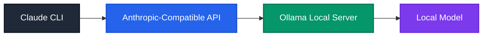
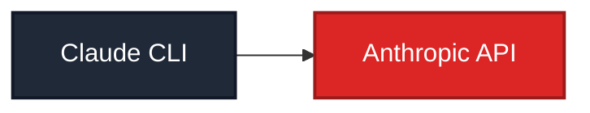
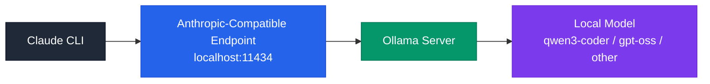
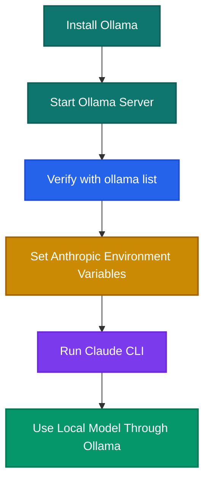
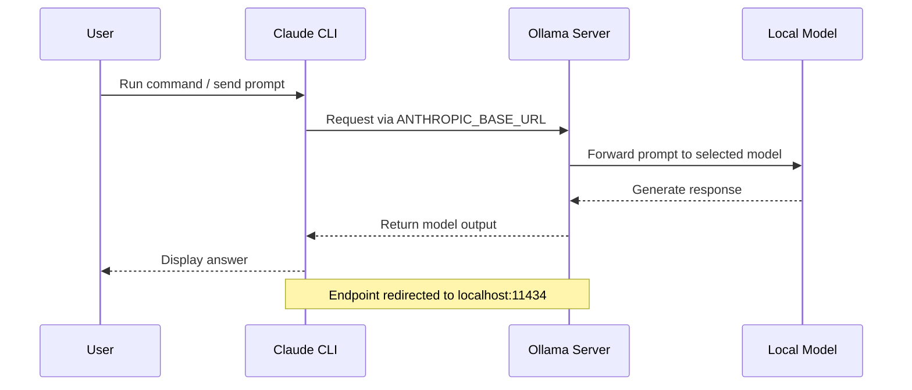
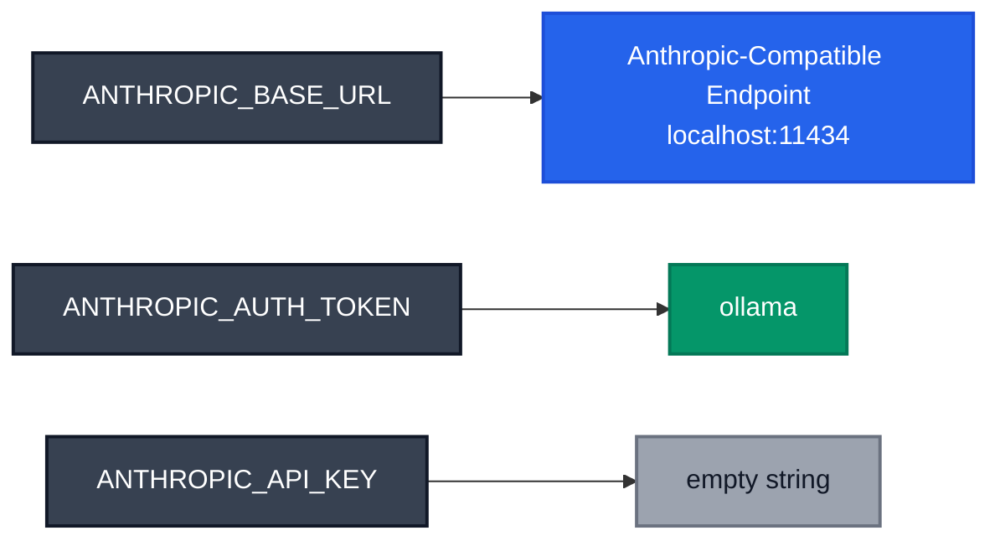
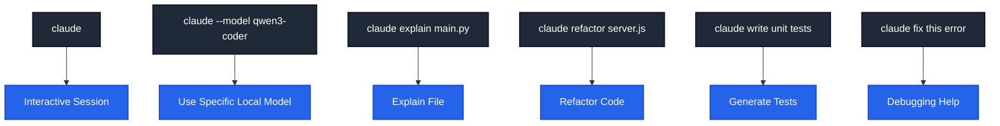

# Claude-Ollama-Coder

> Use the **Claude CLI** with **local models served by Ollama**.

This setup redirects the Anthropic-compatible endpoint used by Claude CLI to a **local Ollama server**, so you can keep the Claude CLI workflow while running open models on your own machine.

## Why this exists

This is useful when you want:

* local LLM inference
* Claude CLI workflow
* coding models such as **Qwen3-Coder** or **GPT-OSS**
* no external API dependency for requests

---

## Requirements

* **Ollama** installed and running
* **Claude CLI** installed
* at least one model available in Ollama, such as:

  * `qwen3-coder`
  * `gpt-oss:120b-cloud`

---

## How it works

Claude CLI normally talks to Anthropic's API.
In this setup, you point it at **Ollama running on `localhost:11434`** instead.



The mildly sneaky part: Claude CLI still thinks it is using an Anthropic-style API, but the actual model is local. Same doorway, different creature behind it.

---

## Architecture

### Default behavior



### With Ollama redirect



---

## Setup

### 1. Start Ollama

```bash
ollama serve
```

Check installed models:

```bash
ollama list
```

### 2. Set environment variables

These variables make Claude CLI use your local Ollama endpoint.

#### PowerShell

```powershell
$env:ANTHROPIC_BASE_URL="http://localhost:11434"
$env:ANTHROPIC_AUTH_TOKEN="ollama"
$env:ANTHROPIC_API_KEY=""
```

### 3. Run Claude with a local model

```bash
claude --model qwen3-coder
```

or:

```bash
claude --model gpt-oss:120b-cloud
```

---

## Setup flow diagram



---

## Usage

Once the environment variables are set, Claude CLI will send requests to Ollama instead of Anthropic.

### Example

```bash
claude --model qwen3-coder
```

### Another example

```bash
claude --model gpt-oss:120b-cloud
```

---

## Request flow



---

## Example workflow

### Check installed models

```bash
ollama list
```

### Start Claude with Qwen3-Coder

```bash
claude --model qwen3-coder
```

### Start Claude with GPT-OSS

```bash
claude --model gpt-oss:120b-cloud
```

---

## Supported models

Any model installed in Ollama can be used, provided Claude CLI can access it through the compatible endpoint.

Examples:

* `qwen3-coder`
* `gpt-oss:120b-cloud`
* `codellama`
* `deepseek-coder`

List what is available:

```bash
ollama list
```

---

## Environment variables explained

| Variable               | Purpose                                               |
| ---------------------- | ----------------------------------------------------- |
| `ANTHROPIC_BASE_URL`   | points Claude CLI to your local Ollama server         |
| `ANTHROPIC_AUTH_TOKEN` | placeholder token expected by the compatibility layer |
| `ANTHROPIC_API_KEY`    | left empty in this local setup                        |

---

## Config diagram



---

## Troubleshooting

### Model not found

Run:

```bash
ollama list
```

Make sure the model name in `claude --model ...` exactly matches the installed model name.

### Connection error

Make sure Ollama is running:

```bash
ollama serve
```

And verify the endpoint is reachable at:

```text
http://localhost:11434
```

### Claude still tries to use Anthropic

Double-check that the environment variables are set in the same shell session where you run `claude`.

---

## Claude CLI Cheatsheet

Common commands and usage patterns for development work.

### Start an interactive session

```bash
claude
```

### Use a specific model

```bash
claude --model qwen3-coder
```

```bash
claude --model gpt-oss:120b-cloud
```

### Ask a one-off question

```bash
claude "explain this codebase"
```

```bash
claude "optimize this python function"
```

### Ask about a file

```bash
claude "explain main.py"
```

```bash
claude "refactor server.js"
```

### Generate code

```bash
claude "write a REST API in FastAPI"
```

```bash
claude "create a React login component"
```

### Improve existing code

```bash
claude "improve performance of this script"
```

```bash
claude "add error handling to this file"
```

### Generate tests

```bash
claude "write unit tests for this module"
```

### Summarize a project

Run this from the project root:

```bash
claude "summarize this project"
```

### Debug an error

```bash
claude "fix this error"
```

Paste the stack trace or failing code into the session.

---

## Claude usage map



---

## Notes

* Ollama must be running on **port `11434`** unless you change the base URL.
* Model names must match the output of `ollama list`.
* Claude CLI must support overriding the Anthropic base URL.
* This setup depends on Anthropic-compatible request handling exposed by Ollama.

---

## Conceptual note

This pattern is a neat little software illusion. The CLI cares less about the metaphysics of the model and more about the shape of the API. Match the shape, and the tool keeps humming. Interfaces are masks; the machine behind the mask can change.