# Claude Code in Action: Complete Guide

## Table of Contents

1. [Understanding Coding Assistants](#understanding-coding-assistants)
2. [Claude Code Fundamentals](#claude-code-fundamentals)
3. [Context Management](#context-management)
4. [Making Effective Changes](#making-effective-changes)
5. [Controlling Context Flow](#controlling-context-flow)
6. [Custom Commands](#custom-commands)
7. [MCP Server Integration](#mcp-server-integration)
8. [GitHub Integration](#github-integration)
9. [Hooks System](#hooks-system)
10. [Advanced Hook Patterns](#advanced-hook-patterns)
11. [Claude Code SDK](#claude-code-sdk)

---

## Understanding Coding Assistants

### What is a Coding Assistant?

A coding assistant is an AI-powered tool that leverages language models to automate software development tasks. Unlike traditional IDEs, coding assistants understand context, reason about problems, and execute complex workflows autonomously.

### Core Architecture

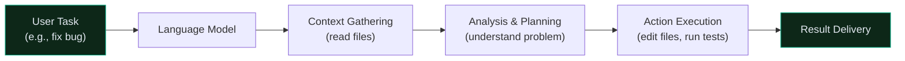

### Tool Use System: How It Works

The fundamental advantage of Claude Code lies in its **tool use system**:

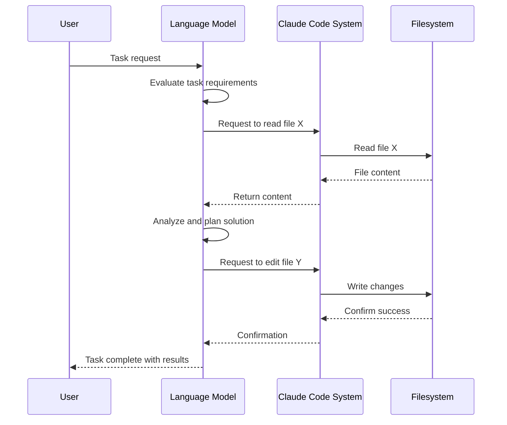

### Key Advantages

**Claude's Tool Use Superiority:**
- ✅ Superior understanding of function contexts
- ✅ Better at combining multiple tools for complex tasks  
- ✅ Extensible architecture for custom tools
- ✅ Direct code search instead of external indexing (better security)
- ✅ Adaptive to development changes

---

## Claude Code Fundamentals

### Real-World Examples

#### Example 1: Performance Optimization

Claude analyzed the **Chalk JavaScript library** (429M weekly downloads):

```
Step 1: Analyzed benchmarks and profiling data
Step 2: Identified performance bottlenecks
Step 3: Implemented optimizations
Step 4: Verified improvements with tests

Result: 3.9x throughput improvement
```

#### Example 2: Data Analysis Workflow

```python
# Claude's workflow for churn analysis
1. Load CSV data from S3
2. Explore data structure and patterns
3. Execute analysis in Jupyter notebook cells
4. Visualize findings with charts
5. Iterate on hypotheses based on results
6. Generate final report
```

#### Example 3: Browser Automation with Playwright

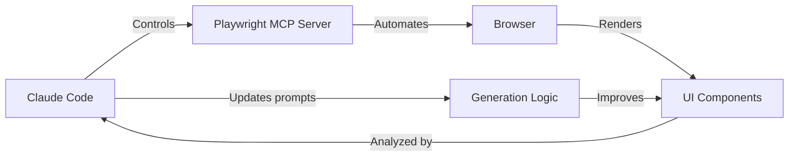

### Default Tools

Claude Code ships with essential tools:

| Tool | Purpose | Example |
|------|---------|---------|
| `read` | Read file contents | `read src/index.ts` |
| `edit` | Create/modify files | `edit src/app.tsx` |
| `grep` | Search across files | `grep "function" --include="*.js"` |
| `run` | Execute commands | `run npm test` |
| `bash` | Shell operations | `bash -c "git status"` |

---

## Context Management

### The Problem: Context Quality

Too much irrelevant context degrades Claude's performance. The solution: **strategic context provision**.

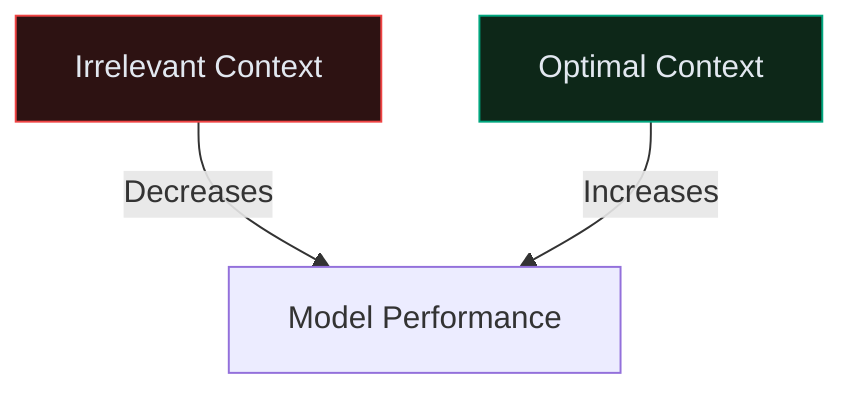

### The `/init` Command

The `/init` command analyzes your entire codebase and creates a `Claude.md` summary:

```bash
/init
```

**Generated file includes:**
- Project summary
- Architecture overview
- Key files and their purposes
- Dependencies and relationships

### Three-Level Claude.md Strategy

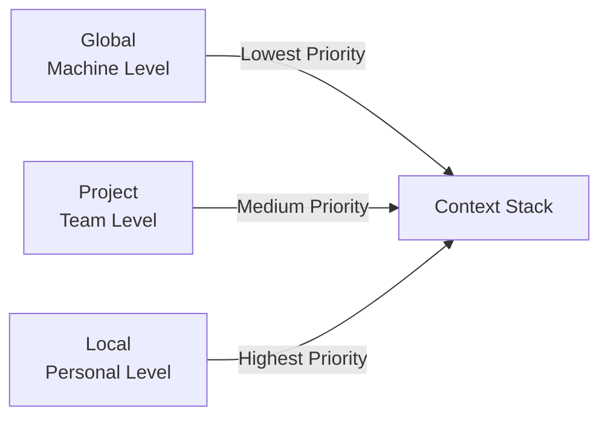

**Implementation:**

```markdown
# Claude.md - Project Level

## Overview
Backend API for e-commerce platform

## Architecture
- Express.js server
- PostgreSQL database
- Redis cache
- Stripe integration

## Key Files
- `src/server.ts` - Main server
- `src/database.ts` - Database layer
- `src/api/routes.ts` - API endpoints

## Critical Schema
@database.ts - Contains core data models
```

### Context Commands

```bash
# Mention specific files for targeted context
@src/database.ts
@src/server.ts

# Or use file patterns
@src/**/*.ts
```

**Best Practices:**
- Include database schemas in Claude.md
- Reference architecture diagrams
- Link critical configuration files
- Update before major refactors

---

## Making Effective Changes

### Screenshot Integration

Paste screenshots directly to help Claude understand UI context:

```
Keyboard: Ctrl+V (Windows/Linux) or Cmd+V (macOS)
```

### Performance Boosting Modes

#### Plan Mode

Enables extended research and planning:

```
Keyboard Shortcut: Shift+Tab twice
Effect: Claude researches files and creates detailed plans before executing
Use Case: Multi-step tasks, significant refactors
```

**Plan Mode Workflow:**

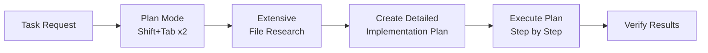

#### Thinking Mode

Provides extended reasoning for complex logic:

```
Trigger Phrases: "Ultra think", "Deep analysis"
Effect: Claude gets extended token budget for complex reasoning
Use Case: Debugging, algorithm design, architectural decisions
```

### Git Integration

Claude Code can manage version control automatically:

```bash
# Claude can:
1. Examine git diff
2. Stage changes
3. Create commits with descriptive messages
4. Push to remote repository
```

---

## Controlling Context Flow

### Context Control Commands

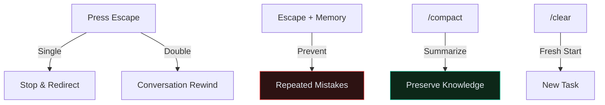

### Practical Usage

**Escape (Single Press):**
```
User: "Claude, let me interrupt here..."
Effect: Claude stops mid-response, awaits new direction
```

**Escape + Memory (# shortcut):**
```
/memory
Note: Claude frequently forgets to update related files.
Always check for dependent functions after signature changes.

Effect: Prevents repeated mistake in future interactions
```

**Double Escape (Conversation Rewind):**
```
Effect: 
- Shows all previous messages
- Skip debugging/back-and-forth
- Jump to earlier point with context intact
```

**Compact Command:**
```
/compact
Effect:
- Summarizes conversation history
- Preserves Claude's learned knowledge
- Removes clutter from context
```

---

## Custom Commands

### What Are Custom Commands?

Custom commands are reusable workflows stored in your project:

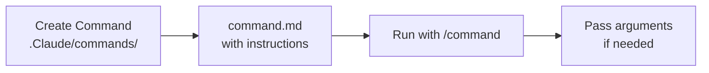

### Implementation

**File Structure:**
```
project/
├── .Claude/
│   ├── commands/
│   │   ├── audit.md
│   │   ├── test-gen.md
│   │   └── security-check.md
│   └── settings.local.json
```

**Example: Dependency Audit Command**

```markdown
# audit.md

You are a dependency auditor. Your task is to:

1. Examine package.json for all dependencies
2. Check for outdated packages
3. Identify security vulnerabilities
4. Suggest updates with compatibility notes

Focus on: $arguments

Run commands:
- npm outdated
- npm audit
- npm audit fix --dry-run

Report findings with:
- Critical vulnerabilities first
- Suggested version updates
- Breaking change warnings
```

**Usage:**
```bash
/audit frontend
/audit backend
/audit all
```

---

## MCP Server Integration

### What is MCP?

**Model Context Protocol (MCP)** extends Claude Code with external capabilities:

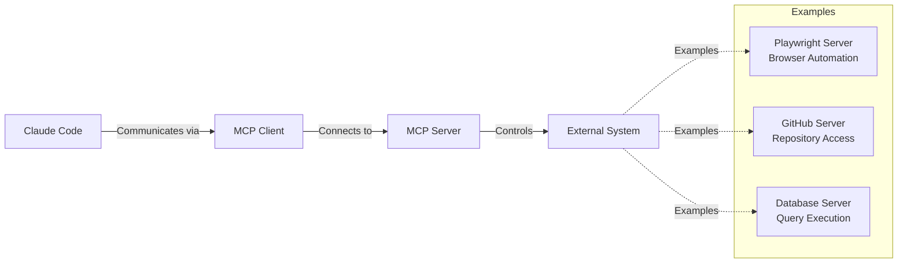

### Installing MCP Servers

```bash
# Add Playwright server for browser automation
claude mcp add playwright "npx @claudeai/playwright-mcp"

# Add GitHub server for repository operations
claude mcp add github "npx @claudeai/github-mcp"
```

### Playwright MCP Workflow

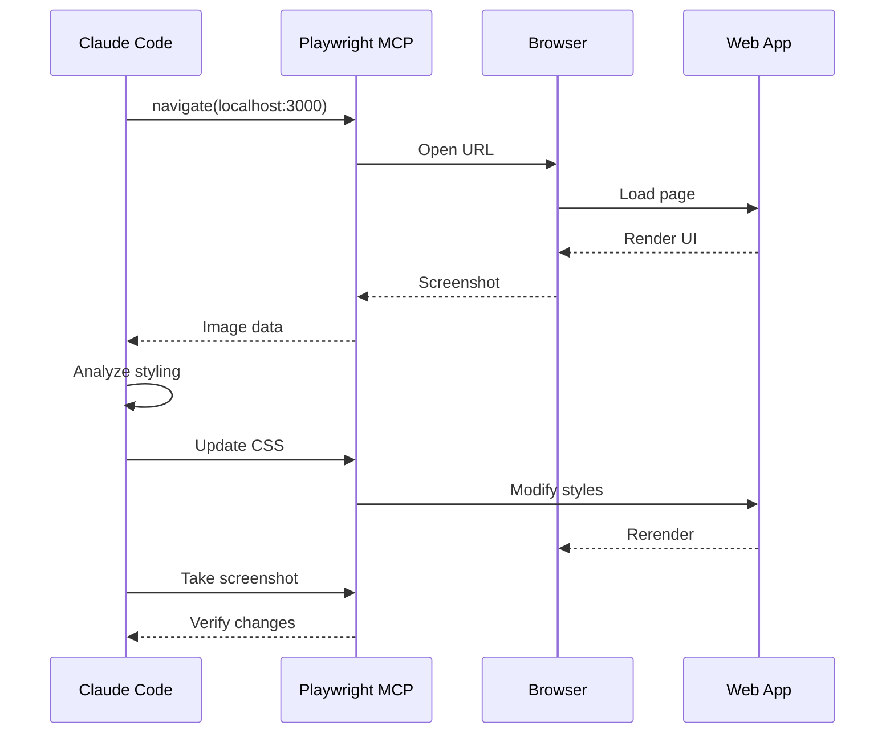

### Permission Management

```json
// settings.local.json
{
  "allowTools": [
    "read",
    "edit",
    "run"
  ],
  "autoApproveMCP": {
    "MCP__playwright": true,
    "MCP__github": false
  }
}
```

---

## GitHub Integration

### Setup Process

```bash
/install GitHub
```

**Steps:**
1. Install Claude Code GitHub App
2. Add API key
3. Auto-generates workflow files

### GitHub Actions Workflow

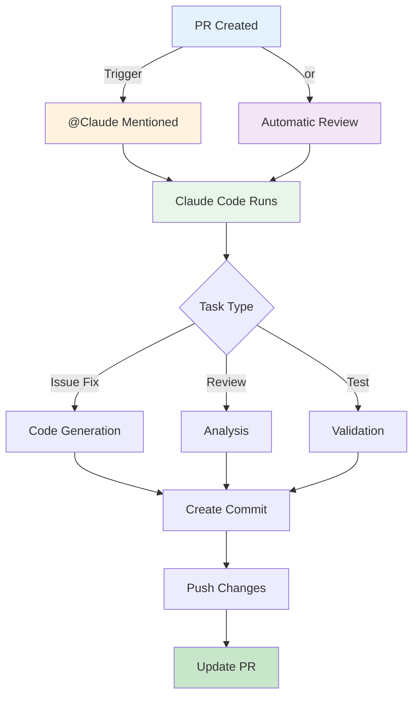

### Workflow File Example

```yaml
# .github/workflows/claude-review.yml
name: Claude Code Review

on:
  pull_request:
    types: [opened, synchronize]

jobs:
  review:
    runs-on: ubuntu-latest
    steps:
      - uses: actions/checkout@v3
      - name: Claude Code Review
        uses: claudeai/claude-code@v1
        with:
          api-key: ${{ secrets.CLAUDE_API_KEY }}
          instructions: |
            Review this PR for:
            - Code quality issues
            - Security vulnerabilities
            - Performance problems
          mcp-servers:
            - playwright
            - github
```

---

## Hooks System

### What Are Hooks?

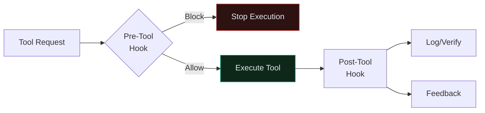

### Hook Types

| Hook Type | Executes | Can Block? | Use Case |
|-----------|----------|-----------|----------|
| **Pre-Tool** | Before execution | ✅ Yes | Restrict file access |
| **Post-Tool** | After execution | ❌ No | Run tests, format code |

### Configuration

```json
// .clod/settings.local.json
{
  "hooks": {
    "preToolUse": {
      "matcher": "read|grep",
      "command": "node ./hooks/read_hook.js"
    },
    "postToolUse": {
      "matcher": "edit",
      "command": "npm run format"
    }
  }
}
```

### Hook Input Format

Hooks receive JSON data via stdin:

```json
{
  "sessionId": "session-123",
  "toolName": "read",
  "toolInput": {
    "path": "/path/to/file.ts"
  }
}
```

### Exit Codes

| Code | Meaning | Hook Type |
|------|---------|-----------|
| `0` | Allow/Success | Pre & Post |
| `2` | Block | Pre only |

---

## Advanced Hook Patterns

### Pattern 1: Block Sensitive Files

```javascript
// hooks/read_hook.js
const readline = require('readline');

const rl = readline.createInterface({
  input: process.stdin,
  output: process.stdout
});

let data = '';

rl.on('line', (line) => {
  data += line;
});

rl.on('close', () => {
  try {
    const input = JSON.parse(data);
    const filePath = input.toolInput.path || '';
    
    // Block .env files
    if (filePath.includes('.env')) {
      console.error('❌ Access denied: .env files are protected');
      process.exit(2);
    }
    
    // Block secrets
    if (filePath.includes('secret') || filePath.includes('private')) {
      console.error('❌ Access denied: Secret files cannot be read');
      process.exit(2);
    }
    
    process.exit(0); // Allow
  } catch (error) {
    console.error('Hook error:', error.message);
    process.exit(0);
  }
});
```

### Pattern 2: TypeScript Type Checking

```javascript
// hooks/typescript_checker.js
const { execSync } = require('child_process');

// Post-tool hook: Run type checking after edits
try {
  const result = execSync('tsc --no-emit', {
    encoding: 'utf8',
    stdio: 'pipe'
  });
  
  console.log('✅ TypeScript check passed');
  process.exit(0);
} catch (error) {
  console.error('❌ Type errors detected:');
  console.error(error.stdout || error.message);
  process.exit(0); // Don't block, just report
}
```

### Pattern 3: Code Duplication Detection

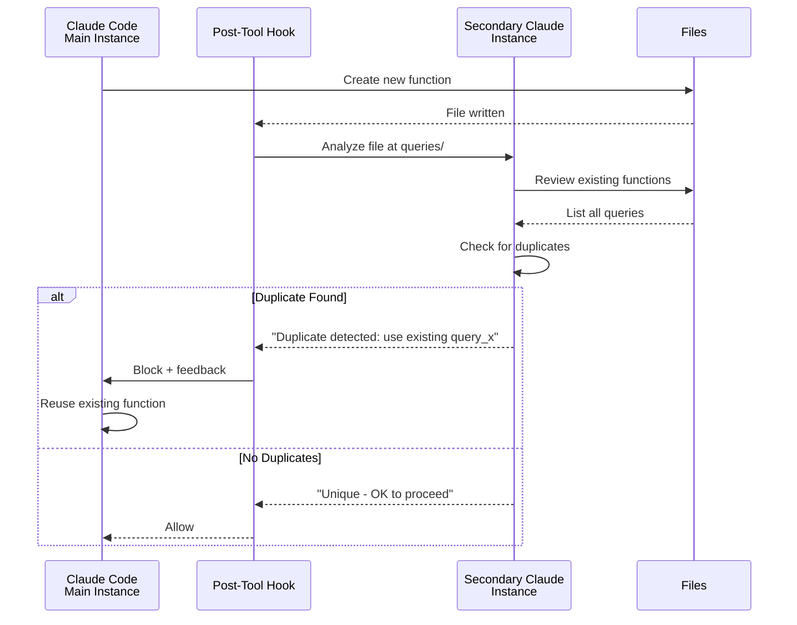

**Implementation:**

```javascript
// hooks/dedup_hook.js
const { query } = require('../claude-sdk');
const { readdir, readFile } = require('fs').promises;

async function checkDuplicates(changedFile) {
  // Get all existing queries
  const queries = await readdir('./src/queries');
  const existing = await Promise.all(
    queries.map(f => readFile(`./src/queries/${f}`, 'utf8'))
  );
  
  // Launch secondary Claude instance
  const analysis = await query(
   `Compare this new query against existing ones:\n\nNew:\n${changedFile}\n\nExisting:\n${existing.join('\n---\n')}\n\nAre there duplicates?`,
    { allowTools: ['read'] }
  );
  
  if (analysis.includes('duplicate')) {
    console.error('Duplicate detected. Reuse the existing function.');
    process.exit(2);
  }
  
  process.exit(0);
}

// Listen for stdin and execute
checkDuplicates(process.argv[2]);
```

---

## Claude Code SDK

### Overview

The Claude Code SDK provides programmatic access to Claude Code capabilities:

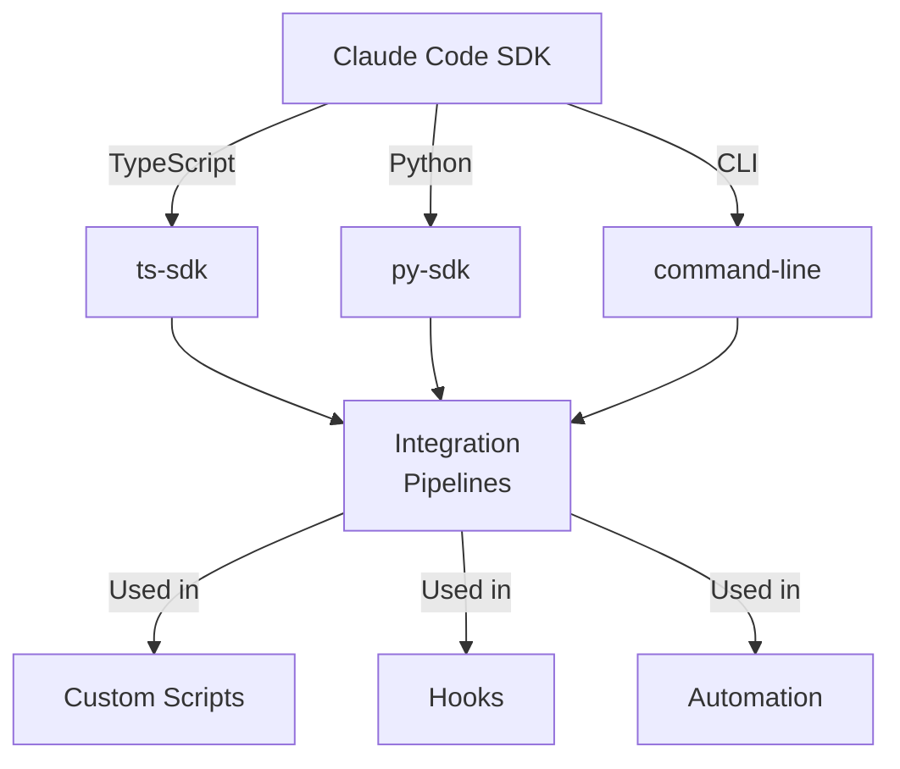

### TypeScript Example

```typescript
import { query } from '@claude/code-sdk';

// Read-only query (default)
const result = await query(
  'List all functions in src/api'
);

// Query with write permissions
const codeGen = await query(
  'Generate unit tests for src/auth.ts',
  {
    allowTools: ['read', 'edit', 'run'],
    cwd: './project',
    systemPrompt: 'You are an expert test writer.'
  }
);

// Access conversation
console.log(codeGen.conversation);
console.log(codeGen.finalMessage);
```

### Python Example

```python
from claude_code import query

# Simple read-only query
result = query("What testing frameworks are used?")

# Query with context
with_context = query(
    "Refactor the database layer for performance",
    allowTools=["read", "edit", "run"],
    cwd="./backend",
    context_files=[
        "src/database/schema.ts",
        "src/database/queries.ts"
    ]
)

print(with_context.final_message)
```

### Permission Model

```json
// Default: Read-only
{
  "allowTools": ["read", "grep"]
}

// With writes
{
  "allowTools": ["read", "grep", "edit", "run"]
}

// Custom permissions
{
  "allowTools": ["read"],
  "blockTools": ["run", "bash"],
  "restrictedPaths": [".env", "secrets/"]
}
```

### Use Cases

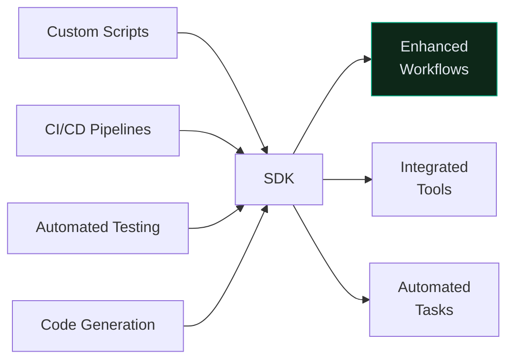

---

## Complete Workflow Example

### Scenario: Add Feature with Validation

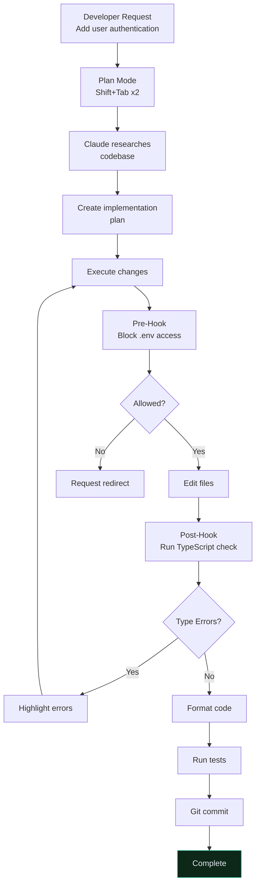

---

## Best Practices

### ✅ Do

- Use `/init` at project start
- Include critical files in Claude.md
- Enable hooks for type checking
- Use Plan Mode for complex tasks
- Screenshot UI elements for changes
- Leverage MCP servers for external tools

### ❌ Don't

- Overload context with irrelevant files
- Store secrets in Claude.md
- Skip hook setup in team projects
- Use Post-Tool hooks to block operations
- Mix multiple unrelated tasks in one session

---

## Related Resources

- [MCP Integration Guide](05_MCP.md)
- [GitHub Actions Setup](https://github.com/docs/actions)
- [Claude API Documentation](04_Building-with-the-Claude-API.md)
- [Custom Commands Reference](#custom-commands)
