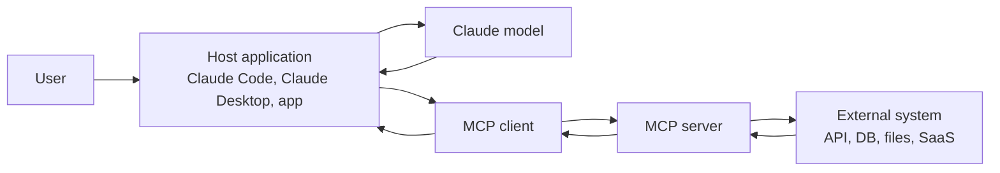
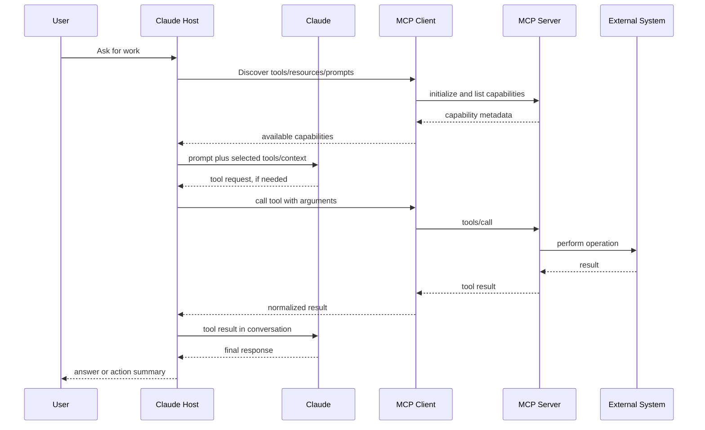

# Model Context Protocol (MCP): Claude Expert Guide

This guide explains Model Context Protocol from a Claude-first engineering perspective. It focuses on how Claude Code, Claude Desktop, Claude.ai, and Claude-powered applications use MCP servers to reach tools, data, and reusable workflows.

Version note: this page is written against the MCP 2025-11-25 specification and current Claude Code MCP behavior as of 2026-05-13. MCP evolves quickly, so verify optional features against the client you are deploying to.

## Table of Contents

1. [Executive Summary](#executive-summary)
2. [Mental Model](#mental-model)
3. [Architecture](#architecture)
4. [Core Primitives](#core-primitives)
5. [Claude Code Integration](#claude-code-integration)
6. [Build a Minimal MCP Server](#build-a-minimal-mcp-server)
7. [Tool Design for Claude](#tool-design-for-claude)
8. [Resource Design](#resource-design)
9. [Prompt Design](#prompt-design)
10. [Advanced Client Features](#advanced-client-features)
11. [Security Review](#security-review)
12. [Production Checklist](#production-checklist)
13. [Documentation Review Checklist](#documentation-review-checklist)
14. [Troubleshooting](#troubleshooting)
15. [Related Resources](#related-resources)

---

## Executive Summary

MCP is an open protocol for connecting AI applications to external systems. For Claude, MCP is the clean way to expose data sources, tools, and workflows without pasting context into chat or hard-coding one-off integrations into every application.

In practical terms:

- Claude remains the reasoning layer.
- The host application runs the user experience, policy, permissions, and model calls.
- The MCP client inside the host talks to MCP servers.
- MCP servers expose capabilities from files, databases, APIs, SaaS products, internal tools, and custom workflows.

MCP is not a model, agent framework, database, memory system, or permission system by itself. It is the protocol boundary that lets a Claude host discover and call capabilities in a consistent way.

---

## Mental Model

Think in ownership boundaries:

| Layer | Responsibility | Claude example |
|------|----------------|----------------|
| Host | Owns the user session, model calls, UI, permissions, and final orchestration | Claude Code, Claude Desktop, Claude.ai, or your app |
| MCP client | Connects the host to one MCP server and translates protocol messages | The MCP client embedded in Claude Code |
| MCP server | Exposes tools, resources, and prompts from an external system | GitHub, Postgres, Figma, local docs, observability |
| External system | Stores data or performs real work | API, database, file system, service |

Claude does not directly "use MCP" in isolation. A Claude host gives Claude selected tool definitions, selected resource content, or selected prompt output. Claude reasons over that context and may request tool calls when tools are available.

### What MCP Solves

Without MCP, every Claude integration needs custom glue:

- Hand-written tool schemas
- Custom API wrappers
- Custom authentication handling
- Repeated prompt templates
- Repeated resource loading logic
- Ad hoc retry and error handling

With MCP, the integration boundary moves into reusable servers. A well-built MCP server can be reused across Claude Code, Claude Desktop, internal agents, and other compatible clients.

### What MCP Does Not Solve

MCP does not automatically make an integration safe. You still need:

- Explicit user consent for sensitive actions
- Least-privilege credentials
- Input and output validation
- Prompt injection defenses
- Audit logs
- Timeouts and rate limits
- Clear ownership of writes and destructive actions

---

## Architecture



The MCP specification separates concerns:

- Base protocol: JSON-RPC 2.0 messages, lifecycle, initialization, capability negotiation, and sessions.
- Transports: `stdio` for local subprocesses and Streamable HTTP for networked servers.
- Server features: tools, resources, and prompts.
- Client features: roots, sampling, and elicitation.
- Utilities: logging, progress, cancellation, completion, pagination, and metadata.

### Request Flow



---

## Core Primitives

MCP has three main server-side primitives. The fastest way to choose the right one is to ask who should decide when it is used.

| Primitive | Control | Use it when | Claude behavior |
|-----------|---------|-------------|-----------------|
| Tool | Model-controlled | Claude should decide to take an action or run a query | Claude can request invocation with typed arguments |
| Resource | Application-controlled | The host should fetch data and provide it as context | Claude sees content only after the host includes or references it |
| Prompt | User-controlled | Users need reusable workflows or commands | Claude receives a server-authored message template |

### Tools

Tools are functions that Claude can ask the host to call. They should be narrow, typed, and clearly described.

Good uses:

- Query an issue tracker
- Read a database schema
- Search internal docs
- Create a pull request
- Run a test command
- Fetch observability data

Avoid tools that are vague, overloaded, or unbounded. A tool named `do_task` with a free-form `instructions` parameter is usually a design failure.

### Resources

Resources expose data by URI. The host decides how and when to load them.

Good uses:

- `docs://api/authentication`
- `repo://README.md`
- `schema://billing/users`
- `incident://2026-05-13/payment-latency`

Resources are ideal for reference data, document content, schemas, and domain context. In Claude Code, resources can be referenced through `@server:protocol://path` when the connected server supports them.

### Prompts

Prompts are reusable, server-defined instruction templates. They are normally user-triggered.

Good uses:

- `/review_security_change`
- `/summarize_incident`
- `/format_document`
- `/write_release_notes`

In Claude Code, MCP prompts appear as commands using names such as `/mcp__github__list_prs`.

---

## Claude Code Integration

Claude Code can connect to MCP servers so Claude can work with tools, databases, APIs, and project-adjacent systems directly.

### Transport Options

Use the transport that matches the deployment:

| Transport | Best for | Notes |
|-----------|----------|-------|
| `stdio` | Local scripts and project-specific tools | Claude Code starts the server as a subprocess |
| `http` or `streamable-http` | Remote or long-running services | Recommended for production and cloud services |

For local `stdio` servers, Claude Code sets `CLAUDE_PROJECT_DIR` for the spawned server process. Use that environment variable when resolving project-relative paths.

### Add a Server

HTTP server:

```bash
claude mcp add --transport http docs http://localhost:8000/mcp
```

Local stdio server:

```bash
claude mcp add docs -- uv run python server.py
```

Project configuration example:

```json
{
  "mcpServers": {
    "docs": {
      "type": "http",
      "url": "http://localhost:8000/mcp"
    }
  }
}
```

### Use Resources in Claude Code

Reference resources with `@`:

```text
Review @docs:docs://api/authentication and identify missing examples.
```

Claude Code can list and read MCP resources when the server supports them. Resource paths should be stable, searchable, and meaningful to a human.

### Use Prompts as Commands

MCP prompts are discoverable through `/`:

```text
/mcp__docs__review_document api/authentication
```

The prompt output is injected into the conversation. Keep prompt arguments simple and predictable.

### Manage Context Cost

Each tool schema can consume context. Prefer:

- Fewer, better tools
- Clear tool names and descriptions
- Resources for large reference content
- Prompts for repeated workflows
- Tool search or deferred loading when supported
- `alwaysLoad` only for a small set of tools needed on nearly every turn

---

## Build a Minimal MCP Server

The official Python SDK provides `FastMCP`, a high-level framework for registering tools, resources, and prompts.

```python
from typing import Annotated

from mcp.server.fastmcp import FastMCP
from pydantic import Field


mcp = FastMCP("docs", json_response=True)

DOCUMENTS = {
    "api/authentication": "# Authentication\n\nUse OAuth scopes per environment.",
    "api/webhooks": "# Webhooks\n\nVerify signatures before processing events.",
}


@mcp.tool()
def search_documents(
    query: Annotated[str, Field(description="Search text")],
    limit: Annotated[int, Field(description="Maximum number of matches", ge=1, le=10)] = 5,
) -> list[dict]:
    """Search documentation titles and content."""
    matches = []
    normalized = query.lower()

    for doc_id, content in DOCUMENTS.items():
        if normalized in doc_id.lower() or normalized in content.lower():
            matches.append({"doc_id": doc_id, "preview": content[:160]})

    return matches[:limit]


@mcp.resource("docs://{doc_id}")
def read_document(doc_id: str) -> str:
    """Read one documentation page by document ID."""
    if doc_id not in DOCUMENTS:
        raise ValueError(f"Unknown document ID: {doc_id}")
    return DOCUMENTS[doc_id]


@mcp.prompt()
def review_document(doc_id: str) -> str:
    """Create a documentation review workflow for a document."""
    return (
        f"Review docs://{doc_id} for accuracy, structure, missing examples, "
        "and unclear Claude/MCP terminology. Return concrete Markdown edits."
    )


if __name__ == "__main__":
    mcp.run(transport="streamable-http")
```

Run and inspect:

```bash
uv run --with mcp python server.py
npx -y @modelcontextprotocol/inspector
```

Add to Claude Code:

```bash
claude mcp add --transport http docs http://localhost:8000/mcp
```

For a `stdio` server, use `mcp.run()` or `mcp.run(transport="stdio")`, then add it with:

```bash
claude mcp add docs -- uv run python server.py
```

---

## Tool Design for Claude

Claude performs best when tools are small, named precisely, and described in terms of when to use them.

### Tool Naming

Use names that encode action and target:

| Good | Weak |
|------|------|
| `search_issues` | `jira` |
| `get_pull_request_diff` | `get_data` |
| `create_release_note_draft` | `write` |
| `query_schema_tables` | `database_tool` |

### Tool Descriptions

Descriptions should answer:

- What the tool does
- When Claude should use it
- What each parameter means
- Whether the tool reads, writes, or has side effects
- What the result contains

Example:

```python
@mcp.tool()
def get_pull_request_diff(owner: str, repo: str, number: int) -> dict:
    """Read the unified diff for one GitHub pull request.

    Use this when Claude needs exact changed lines before reviewing,
    summarizing, or suggesting fixes. This is read-only.
    """
    ...
```

### Inputs

Prefer structured parameters over free-form instructions:

```python
def create_issue(title: str, body: str, labels: list[str]) -> dict:
    ...
```

Avoid:

```python
def run_anything(instructions: str) -> str:
    ...
```

Use validation for:

- IDs
- file paths
- URLs
- enum values
- limits
- date ranges
- write permissions

### Outputs

Tool results should be compact and task-relevant.

Return:

- Stable IDs
- URLs or resource links for large objects
- Clear status fields
- Short summaries
- Structured fields Claude can reason over

Avoid returning:

- Huge logs by default
- Entire database rows with secrets
- Raw HTML when parsed text is enough
- Ambiguous success messages
- Sensitive data not required for the task

When returning structured content, also provide a human-readable text summary if the client or model may need backward compatibility.

### Errors

Use errors to help Claude self-correct.

Good error:

```text
Document not found: api/auth. Available IDs: api/authentication, api/webhooks.
```

Weak error:

```text
Failed.
```

For input validation problems, return tool execution errors where the client and SDK support that path. Reserve protocol errors for protocol-level problems such as unknown methods, malformed JSON-RPC, or unsupported capabilities.

---

## Resource Design

Resources are for context, not actions. They let the host fetch data and decide how much to expose to Claude.

### URI Design

Use stable, readable URI schemes:

```text
docs://api/authentication
repo://src/server.py
schema://billing/users
incident://2026-05-13/payment-latency
```

Rules:

- Keep URIs stable over time.
- Include MIME types such as `text/markdown`, `application/json`, or `text/x-python`.
- Use resource templates for parameterized access.
- Expose indexes for discovery.
- Do not encode secrets in URIs.

### Static and Templated Resources

```python
@mcp.resource("docs://index")
def list_docs() -> str:
    """Return a Markdown index of available docs."""
    return "\n".join(f"- {doc_id}" for doc_id in sorted(DOCUMENTS))


@mcp.resource("docs://{doc_id}")
def read_doc(doc_id: str) -> str:
    """Return one Markdown document."""
    if doc_id not in DOCUMENTS:
        raise ValueError(f"Unknown document ID: {doc_id}")
    return DOCUMENTS[doc_id]
```

### Resource vs Tool

Use a resource when the host should decide what context to include:

```text
Read docs://api/authentication
```

Use a tool when Claude should decide to perform an operation:

```text
search_documents(query="token refresh")
```

This distinction matters. Resources keep context selection explicit. Tools let Claude initiate actions.

---

## Prompt Design

Prompts package expert workflows so users do not have to remember long instructions.

### Prompt Structure

Good prompts include:

- Purpose
- Inputs
- Expected output format
- Constraints
- Required tools or resources
- Review criteria

Example:

```python
@mcp.prompt()
def review_mcp_doc(doc_id: str) -> str:
    return f"""
Review docs://{doc_id} as Claude documentation.

Check:
1. Accuracy against MCP terminology.
2. Clear distinction between tools, resources, and prompts.
3. Security guidance for Claude Code users.
4. Missing examples or unclear setup steps.
5. Markdown structure and broken links.

Return:
- Findings ordered by severity.
- Concrete rewrite suggestions.
- A concise final recommendation.
"""
```

### Prompt Boundaries

Prompts should not hide policy, override user intent, or smuggle unreviewed instructions into the session. Treat prompt content as part of the user-visible workflow.

---

## Advanced Client Features

MCP also defines client-side features. Support varies by host and version.

| Feature | Direction | Purpose | Expert use |
|---------|-----------|---------|------------|
| Roots | Client to server | Tell servers which directories or URI roots are in scope | Limit file access to the current project |
| Sampling | Server to client | Let a server request model completions through the host | Use sparingly for agentic server workflows |
| Elicitation | Server to client | Ask the user for missing information during a workflow | Ask for required choices without inventing them |

### Roots

Roots help servers understand allowed workspaces. A file-system server should use roots to avoid reading or writing outside the user's intended project.

### Sampling

Sampling lets a server ask the host to perform an LLM call. This is powerful but sensitive because it can create recursive agent behavior. Use it only when:

- The user understands why it is needed.
- The host can show and approve the request.
- The server does not receive hidden or unrelated prompt context.

### Elicitation

Elicitation lets a server request missing user input through the host. Use it for choices such as environment, branch name, or deployment target. Do not use it to bypass normal authentication or consent flows.

---

## Security Review

MCP expands what Claude can read and do. Treat every connected server as a privileged integration.

### Threat Model

Review these risks before connecting or publishing a server:

- Prompt injection from external content
- Tool poisoning through misleading tool descriptions
- Exfiltration through overly broad read tools
- Destructive actions without confirmation
- Secrets exposed in resources, logs, errors, or tool results
- Path traversal in file tools
- SQL injection or unsafe query building
- SSRF through URL-fetching tools
- Cross-origin attacks against local HTTP servers
- Over-broad OAuth scopes

### Required Controls

Use these controls for production servers:

- Validate every input.
- Enforce access control inside the server.
- Scope credentials to the smallest useful permission set.
- Require confirmation for writes, deletes, payments, deploys, and external sends.
- Bind local HTTP servers to `127.0.0.1` unless remote access is required.
- Validate `Origin` headers for Streamable HTTP.
- Use OAuth or another explicit authorization layer for remote HTTP servers.
- Redact secrets from logs and returned content.
- Add timeouts for every external call.
- Rate-limit expensive or sensitive tools.
- Keep audit logs for tool invocations.

### Claude-Specific Safety

Claude can reason about tool descriptions, but descriptions are not a security boundary. The host and server must enforce policy.

Do not rely on Claude to:

- Notice every malicious instruction in retrieved content
- Refuse every unsafe tool call without host controls
- Distinguish trusted from untrusted tool descriptions automatically
- Protect secrets that the server returns unnecessarily

---

## Production Checklist

Use this checklist before shipping an MCP server.

### Capability Design

- Tools are narrow and have clear side-effect boundaries.
- Resources use stable URIs and correct MIME types.
- Prompts are user-triggered and auditable.
- Tool names are specific and discoverable.
- Large data is exposed as resources or paginated results.

### Protocol and Compatibility

- Server negotiates capabilities during initialization.
- Server supports the target protocol version.
- Pagination is implemented for long lists.
- Tool and resource lists are deterministic where practical.
- HTTP servers use the `MCP-Protocol-Version` header where required.
- Optional features are documented as optional.

### Runtime Reliability

- External calls have timeouts.
- Tool execution is logged with request IDs.
- Errors are actionable and safe to show Claude.
- Long-running tasks report progress where supported.
- Server startup and shutdown are clean.
- Health checks exist for remote services.

### Security

- Credentials are scoped and rotated.
- Sensitive actions require confirmation.
- Secrets are redacted from results, logs, and traces.
- Path and URL inputs are constrained.
- Remote servers use authentication and TLS.
- Local Streamable HTTP servers validate `Origin`.

### Claude Experience

- Claude can infer when to use each tool.
- Tool results are concise enough for context.
- Resource names are readable in `@` autocomplete.
- Prompts produce high-quality, predictable workflows.
- The server does not flood context with unnecessary schemas.

---

## Documentation Review Checklist

Use this section when reviewing MCP documentation in this repository.

### Structure

- The page starts with a practical definition and scope.
- The architecture explains host, client, server, and external system.
- Tools, resources, and prompts are separated by control model.
- Claude Code instructions are distinct from generic MCP protocol details.
- Advanced features are marked as optional and client-dependent.

### Accuracy

- Tool use is described as model-controlled, not server-controlled.
- Resources are described as application-controlled context, not actions.
- Prompts are described as user-controlled workflows.
- Transports mention `stdio` and Streamable HTTP.
- HTTP authorization is not treated as required for `stdio`.
- Security guidance does not imply MCP is safe by default.

### Markdown Quality

- No pasted raw notes or transcript fragments remain.
- No broken XML-style note tags remain.
- No emoji headings or decorative symbols are used.
- Tables have consistent columns.
- Mermaid diagrams are simple and renderable.
- Code examples are short enough to maintain.
- Official references are linked at the end.

---

## Troubleshooting

| Symptom | Likely cause | Fix |
|---------|--------------|-----|
| Claude cannot see the server | Server is not configured or Claude Code was not restarted | Run `claude mcp list`, check config, then restart if needed |
| Tools appear but fail | Missing credentials or wrong environment | Check server logs and environment variables |
| Claude calls the wrong tool | Names or descriptions are ambiguous | Rename tools and add stronger usage descriptions |
| Context fills up quickly | Too many large tool schemas or huge results | Use resources, pagination, and deferred tool loading |
| Resource cannot be referenced | URI is unstable or server lacks resource support | Add `resources/list`, clear URI names, and MIME types |
| HTTP server works locally but is unsafe | Bound to all interfaces or missing Origin validation | Bind to `127.0.0.1` and validate `Origin` |
| Claude repeats invalid calls | Error message is too vague | Return actionable errors with valid alternatives |
| Prompt command is missing | Prompt capability is not declared or client does not expose prompts | Verify prompt registration and client feature support |

---

## Related Resources

- [Official MCP documentation](https://modelcontextprotocol.io/docs/getting-started/intro)
- [MCP 2025-11-25 specification](https://modelcontextprotocol.io/specification/2025-11-25/basic)
- [MCP tools specification](https://modelcontextprotocol.io/specification/2025-11-25/server/tools)
- [MCP resources specification](https://modelcontextprotocol.io/specification/2025-11-25/server/resources)
- [MCP prompts specification](https://modelcontextprotocol.io/specification/2025-11-25/server/prompts)
- [MCP transports specification](https://modelcontextprotocol.io/specification/2025-11-25/basic/transports)
- [Claude Code MCP documentation](https://code.claude.com/docs/en/mcp)
- [Official MCP Python SDK](https://github.com/modelcontextprotocol/python-sdk)
- [Building with the Claude API](./04_Building-with-the-Claude-API.md)
- [Advanced MCP Patterns](./06_MCP-Advanded.md)
