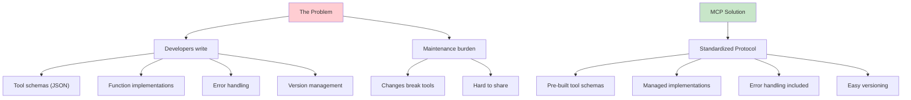
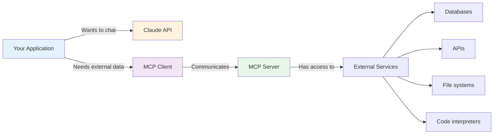
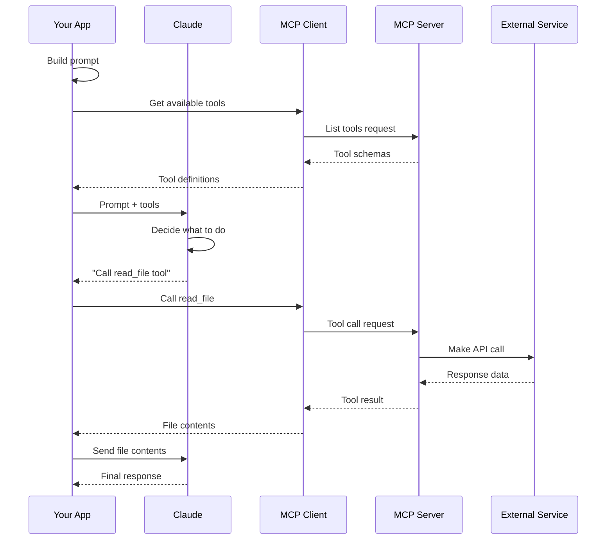
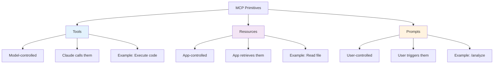

# Model Context Protocol (MCP): Complete Guide

## Table of Contents
1. [MCP Fundamentals](#mcp-fundamentals)
2. [Architecture Overview](#architecture-overview)
3. [MCP Clients](#mcp-clients)
4. [MCP Servers](#mcp-servers)
5. [Defining Tools](#defining-tools)
6. [Using Resources](#using-resources)
7. [Creating Prompts](#creating-prompts)
8. [Advanced Patterns](#advanced-patterns)
9. [Production Deployment](#production-deployment)
10. [Best Practices](#best-practices)

---

## MCP Fundamentals

### What is MCP?

**Model Context Protocol** = standard interface for connecting language models to external data and tools without writing complex integrations.



### Three Primitives

MCP defines three types of capabilities:

```python
mcp_primitives = {
    "Tools": {
        "description": "Model-controlled operations",
        "when_used": "Claude decides when to call",
        "example": "Execute JavaScript, query database",
        "serves": "The model/Claude"
    },
    "Resources": {
        "description": "Application-controlled data",
        "when_used": "App decides when to retrieve",
        "example": "Read file, list database records",
        "serves": "The application"
    },
    "Prompts": {
        "description": "User-triggered workflows",
        "when_used": "User initiates via slash command",
        "example": "/format, /analyze, /summarize",
        "serves": "The user"
    }
}
```

---

## Architecture Overview

### Client-Server Model



### Communication Flow



---

## MCP Clients

### What is an MCP Client?

An MCP Client is a wrapper that communicates with MCP servers on behalf of your application.

```python
import json
import asyncio
from mcp.client.session import ClientSession
from mcp.client.stdio import StdioClientTransport
from mcp.types import Tool

class MCPClient:
    def __init__(self, server_script_path: str):
        """Initialize connection to MCP server.
        
        Args:
            server_script_path: Path to MCP server Python script
        """
        self.session = None
        self.server_script_path = server_script_path
        self.tools = []
    
    async def connect(self):
        """Establish connection to MCP server."""
        transport = StdioClientTransport(
            self.server_script_path,
            ["python", "-m", "mcp.client"]
        )
        self.session = ClientSession(transport)
        await self.session.initialize()
        
        # Get available tools
        result = await self.session.list_tools()
        self.tools = result.tools
    
    async def call_tool(self, tool_name: str, tool_input: dict):
        """Execute a tool on the MCP server.
        
        Args:
            tool_name: Name of tool to call
            tool_input: Dictionary of tool arguments
            
        Returns:
            Tool execution result
        """
        result = await self.session.call_tool(tool_name, tool_input)
        return result
    
    async def close(self):
        """Clean up connection."""
        if self.session:
            await self.session.close()

# Usage example
async def main():
    client = MCPClient("server.py")
    
    try:
        await client.connect()
        print(f"Connected. Available tools: {[t.name for t in client.tools]}")
        
        # Call a tool
        result = await client.call_tool(
            "read_document",
            {"doc_id": "report.md"}
        )
        print(result)
        
    finally:
        await client.close()

# Run it
# asyncio.run(main())
```

---

## MCP Servers

### Creating an MCP Server

```python
import mcp.server.stdio
from mcp.server import Server
from mcp.types import TextContent, Tool

# Create server instance
server = Server("my-tool-server")

# In-memory document storage
documents = {
    "guide.md": "# Getting Started\n\nWelcome to our guide...",
    "api-docs.md": "# API Reference\n\nBase URL: https://api...",
}

@server.tool()
def read_document(doc_id: str) -> str:
    """Read the full contents of a document.
    
    Args:
        doc_id: ID of document to read
        
    Returns:
        Complete document text
    """
    if doc_id not in documents:
        raise ValueError(f"Document '{doc_id}' not found")
    return documents[doc_id]

@server.tool()
def list_documents() -> list:
    """List all available documents.
    
    Returns:
        List of document IDs
    """
    return list(documents.keys())

@server.tool()
def edit_document(doc_id: str, old_text: str, new_text: str) -> str:
    """Replace text in a document.
    
    Args:
        doc_id: Document to edit
        old_text: Text to find  
        new_text: Replacement text
        
    Returns:
        Confirmation message
    """
    if doc_id not in documents:
        raise ValueError(f"Document '{doc_id}' not found")
    
    if old_text not in documents[doc_id]:
        raise ValueError(f"Text not found in document")
    
    documents[doc_id] = documents[doc_id].replace(old_text, new_text)
    return f"Updated '{doc_id}': replaced {len(old_text)} characters"

# Run server
if __name__ == "__main__":
    mcp.server.stdio.stdio_server(server)
```

### Server Inspector (Debugging)

```bash
# Test your server during development
mcp dev server.py

# Opens browser at http://localhost:5173
# Allows manual tool testing before production use

# Features:
# - Tool listing in sidebar
# - Manual parameter input
# - Run tool and see results
# - Debug messages
```

---

## Defining Tools

### Tool Schemas (Auto-Generated)

When using MCP Python SDK, tool schemas are automatically generated from your functions:

```python
from mcp.server import Server
from pydantic import Field

server = Server("calculator-server")

@server.tool()
def add_numbers(
    a: float = Field(description="First number"),
    b: float = Field(description="Second number")
) -> float:
    """Add two numbers together.
    
    Perfect for when Claude needs to calculate sum of values.
    """
    return a + b

@server.tool()
def calculate_percentage(
    value: float = Field(description="The value"),
    percentage: float = Field(description="Percentage (0-100)"),
) -> float:
    """Calculate a percentage of a value."""
    return value * (percentage / 100)

# MCP automatically generates:
# {
#   "name": "add_numbers",
#   "description": "Add two numbers together...",
#   "inputSchema": {
#     "type": "object",
#     "properties": {
#       "a": {"type": "number", "description": "First number"},
#       "b": {"type": "number", "description": "Second number"}
#     },
#     "required": ["a", "b"]
#   }
# }
```

### Error Handling in Tools

```python
@server.tool()
def safe_divide(
    dividend: float = Field(description="Number to divide"),
    divisor: float = Field(description="Number to divide by"),
) -> float:
    """Divide two numbers safely.
    
    Returns:
        Result or error message
    """
    if divisor == 0:
        raise ValueError("Cannot divide by zero. Choose a different divisor.")
    
    if dividend == 0:
        raise ValueError("Cannot divide zero. Use a non-zero dividend.")
    
    return dividend / divisor

# When error raised, MCP passes to Claude with is_error=true
# Claude can see error and retry with different parameters
```

---

## Using Resources

### Defining Resources

Resources expose read-only data to clients:

```python
from mcp.server import Server
from mcp.types import Resource
from mcp.resource import ResourceTemplate
import json

server = Server("data-server")

# Static resource
@server.resource(
    uri="data://documents",
    name="Document List",
    description="List of all available documents",
    mime_type="application/json"
)
def list_all_documents() -> str:
    """Return list of documents as JSON."""
    documents = [
        {"id": "guide", "title": "Getting Started"},
        {"id": "api", "title": "API Reference"},
    ]
    return json.dumps(documents)

# Templated resource (with parameters)
@server.resource(
    uri="data://documents/{doc_id}",
    name="Document Content",
    description="Content of a specific document",
    mime_type="text/plain"
)
def get_document(doc_id: str) -> str:
    """Get specific document content.
    
    Args:
        doc_id: Document identifier from URI template
    
    Returns:
        Document content
    """
    documents = {
        "guide": "# Getting Started Guide\n...",
        "api": "# API Documentation\n...",
    }
    
    if doc_id not in documents:
        raise ValueError(f"Document '{doc_id}' not found")
    
    return documents[doc_id]

# Clients access via:
# await client.read_resource("data://documents")
# await client.read_resource("data://documents/guide")
```

### Accessing Resources (Client Side)

```python
async def read_resource_example():
    """Show how client reads resources."""
    
    # Get list of documents
    list_result = await client.session.read_resource(
        AnyUrl("data://documents")
    )
    documents = json.loads(list_result.contents[0].text)
    
    # Read specific document
    doc_result = await client.session.read_resource(
        AnyUrl(f"data://documents/{documents[0]['id']}")
    )
    content = doc_result.contents[0].text
    
    return documents, content
```

---

## Creating Prompts

### Prompt Definition

Prompts are pre-written, tested instructions for specialized tasks:

```python
from mcp.server import Server
from mcp.types import TextContent

server = Server("prompt-server")

@server.prompt(
    name="analyze",
    description="Analyze a document and extract key insights"
)
def analyze_prompt(doc_id: str = "default") -> list:
    """Create prompt for document analysis.
    
    Args:
        doc_id: Which document to analyze
        
    Returns:
        List of message dicts for Claude
    """
    prompt_text = f"""Analyze the document with ID '{doc_id}' and provide:
    
1. **Summary**: 2-3 sentence overview
2. **Key Points**: 3-5 main takeaways
3. **Action Items**: Any recommended next steps
4. **Questions**: 2-3 questions for clarification

Use the read_document tool to get the content first."""
    
    return [{"role": "user", "content": prompt_text}]

@server.prompt(
    name="format",
    description="Reformat document to markdown with proper structure"
)
def format_prompt(doc_id: str) -> list:
    """Create prompt for document formatting."""
    return [
        {
            "role": "user",
            "content": f"""Reformat document '{doc_id}' as follows:

1. Add markdown headers for sections
2. Use inline code for technical terms  
3. Create bulleted lists for multi-item concepts
4. Use bold for important terms
5. Preserve all original information

Output should be properly formatted markdown."""
        }
    ]

# Clients access via: 
# await client.get_prompt("analyze", {"doc_id": "guide"})
# Returns formatted messages ready for Claude
```

### Slash Commands (User Interaction)

```bash
# User types in CLI interface
/analyze guide
# Server returns analysis prompt for that document

/format api
# Server returns formatting prompt

/summary report
# Server returns summary prompt

# App intercepts these commands, calls server for prompt,
# then sends to Claude with appropriate tools access
```

---

## Advanced Patterns

### Tool Chaining (Multiple Calls)

```python
# User: "Compare these two documents"
# Claude decides to call read_document twice and analyze_diff

@server.tool()
def read_document(doc_id: str) -> str:
    """Read document content."""
    # ...

@server.tool()
def analyze_differences(
    text1: str = Field(description="First text"),
    text2: str = Field(description="Second text"),
) -> dict:
    """Analyze differences between two texts.
    
    Returns structured comparison.
    """
    # Claude gets text from read_document calls
    # Then calls this to analyze differences
    return {
        "similarities": [...],
        "differences": [...],
        "recommendation": "..."
    }
```

### Dynamic Tool Availability

```python
async def get_conditional_tools(user_role: str) -> list:
    """Return different tools based on user role."""
    
    base_tools = [
        server_instance.tools.read_document,  # Everyone
    ]
    
    if user_role == "admin":
        base_tools.extend([
            server_instance.tools.delete_document,
            server_instance.tools.create_document,
        ])
    
    if user_role == "viewer":
        # No edit tools for viewers
        pass
    
    return base_tools
```

---

## Production Deployment

### Server Configuration

```python
# config.py
from pydantic_settings import BaseSettings

class MCPServerConfig(BaseSettings):
    server_name: str = "production-server"
    port: int = 9000
    enable_logging: bool = True
    max_tool_timeout: int = 30  # seconds
    allowed_resources: list = [
        "data://documents",
        "data://users",
    ]
    
    class Config:
        env_file = ".env"

# server.py
from config import MCPServerConfig

config = MCPServerConfig()
server = Server(config.server_name)

@server.tool()
def long_running_operation():
    """Tool with timeout protection."""
    # Implementation with timeout handling
    pass
```

### Monitoring & Logging

```python
import logging
from datetime import datetime

# Setup logging
logger = logging.getLogger(__name__)
logger.setLevel(logging.DEBUG)

@server.tool()
def monitored_tool(param: str) -> str:
    """Tool with monitoring."""
    start = datetime.now()
    
    try:
        logger.info(f"Tool called with param: {param}")
        result = do_work(param)
        
        elapsed = (datetime.now() - start).total_seconds()
        logger.info(f"Tool completed in {elapsed}s")
        
        return result
        
    except Exception as e:
        logger.error(f"Tool failed: {e}", exc_info=True)
        raise
```

---

## Best Practices

### ✅ Do

```python
# 1. Comprehensive descriptions
@server.tool()
def good_tool(
    user_id: str = Field(description="Unique user identifier (UUID format)")
) -> dict:
    """Fetch user profile and preferences.
    
    Returns complete user data including name, email, and settings.
    """

# 2. Input validation
def validate_user_id(user_id: str) -> bool:
    import uuid
    try:
        uuid.UUID(user_id)
        return True
    except ValueError:
        return False

@server.tool()
def safe_get_user(user_id: str) -> dict:
    if not validate_user_id(user_id):
        raise ValueError("Invalid user ID format")
    return fetch_user(user_id)

# 3. Meaningful error messages (help Claude retry)
if not resource.exists():
    raise ValueError(
        "Resource not found. Available resources: "
        + ", ".join(list_resources())
    )

# 4. Test servers during development
# mcp dev server.py
```

### ❌ Don't

```python
# 1. Vague descriptions
@server.tool()
def bad_tool(param: str) -> str:  # What does this do?
    """Do something with the parameter."""

# 2. Silent failures
@server.tool()
def risky_tool(user_id: str) -> dict:
    try:
        return fetch_user(user_id)
    except:
        pass  # BAD - Claude gets no feedback

# 3. Exposing sensitive data
@server.tool()
def leak_passwords() -> list:
    """Returns all user passwords - NEVER DO THIS"""
    return database.all_passwords()

# 4. Tools that are too complex
@server.tool()
def do_everything(params: dict) -> dict:
    """This tool does too much - split it up"""
    # Hundreds of lines of logic...
```

---

## MCP Primitives Summary



### Decision Matrix

| Need | Primitive | When | Example |
|------|-----------|------|---------|
| Claude to take action | **Tool** | Claude decides | Read database, execute code |
| App to get data | **Resource** | App decides | Fetch user profile, list files |
| User productivity | **Prompt** | User initiates | /format, /analyze, /summarize |

---

## Related Resources
- [Claude Code in Action](./01_Claude-Code-in-Action.md)
- [Building with the API](./04_Building-with-the-Claude-API.md)
- [Claude 101: Fundamentals](./02_Claude-101.md)
- [Official MCP Documentation](https://modelcontextprotocol.io)
MCP = Model Context Protocol, communication layer providing Claude with context and tools without requiring developers to write tedious code.

Core Architecture: MCP client connects to MCP server. MCP server contains tools, resources, and prompts as internal components.

Problem Solved: Traditional approach requires developers to manually author tool schemas and functions for each service integration (like GitHub API tools). This creates maintenance burden for complex services with many features.

MCP Solution: Shifts tool definition and execution from developer's server to dedicated MCP server. MCP server = interface to outside service, wrapping functionality into pre-built tools.

Key Benefits: Eliminates need for developers to write/maintain tool schemas and function implementations. Someone else authors the tools, packages them in MCP server.

Common Questions:
- Who authors MCP servers? Anyone, but often service providers create official implementations
- Difference from direct API calls? Saves developer time by providing pre-built tool schemas/functions instead of manual authoring
- Relationship to tool use? MCP and tool use are complementary, not identical. MCP focuses on who does the work of creating tools

Core Value: Reduces developer burden by outsourcing tool creation to MCP server implementations rather than requiring custom tool development for each service integration.
</note>

<note title="MCP Clients">
MCP Client = communication interface between your server and MCP server, provides access to server's tools.

Transport agnostic = client/server can communicate via multiple protocols (stdin/stdout, HTTP, WebSockets, etc). Common setup: both on same machine using stdin/stdout.

Communication = message exchange defined by MCP spec. Key message types:
- list tools request/result = client asks server for available tools, server responds with tool list
- call tool request/result = client asks server to run tool with arguments, server returns execution result

Typical flow: User query → Server asks MCP client for tools → MCP client sends list tools request to MCP server → Server gets tool list → Server sends query + tools to Claude → Claude requests tool execution → Server asks MCP client to run tool → MCP client sends call tool request to MCP server → MCP server executes tool (e.g., GitHub API call) → Results flow back through chain → Claude formulates final response → User gets answer.

MCP client acts as intermediary - doesn't execute tools itself, just facilitates communication between your server and MCP server that actually runs the tools.
</note>

<note title="Project Setup">
MCP Learning Project = CLI-based chatbot implementing both client and server components for educational purposes.

Project Structure = Custom MCP client connects to custom MCP server, both built in same project.

Document System = Fake documents stored in memory only, no persistence.

Server Tools = Two tools implemented: read document contents, update document contents.

Real-world Context = Normally projects implement either client OR server, not both. This project does both for learning.

Setup Requirements = Download CLI_project.zip, extract, configure .env with API key, install dependencies.

Running Project = "uv run main.py" (with UV) or "python main.py" (without UV).

Verification = Chat prompt appears, responds to basic queries like "what's one plus one".
</note>

<note title="Defining Tools with MCP">
MCP server implementation = Python SDK simplifies tool creation vs manual JSON schemas

Tool definition syntax = @mcp.tool decorator + function with typed parameters + Field descriptions

Document storage = in-memory dictionary with doc_id keys and content values

Tool 1 - read_doc_contents = takes doc_id string parameter, returns document content from docs dictionary, raises ValueError if doc not found

Tool 2 - edit_document = takes doc_id, old_string, new_string parameters, performs find/replace operation on document content, includes existence validation

MCP Python SDK benefits = auto-generates JSON schemas from decorated functions, single line server creation, eliminates manual schema writing

Parameter definition = use Field() with description for tool arguments, import from pydantic

Error handling = validate document existence before operations, raise ValueError for missing documents

Implementation pattern = decorator → function definition → parameter typing → validation → core logic
</note>

<note title="The Server Inspector">
MCP Inspector = in-browser debugger for testing MCP servers without connecting to actual applications

Access: Run \`mcp dev [server_file.py]\` in terminal with activated Python environment → opens server on port → visit provided localhost address

Interface: Left sidebar with Connect button → top navigation bar shows Resources/Prompts/Tools sections → Tools section lists available tools → click tool to open right panel for manual testing

Testing process: Select tool → input required parameters (like document ID) → click Run Tool → verify output/success message

Key features: Live development testing, tool invocation simulation, parameter input fields, success/failure feedback

Status: Inspector in active development - UI may change but core functionality remains similar

Usage pattern: Essential for MCP server development and debugging before production deployment
</note>

<note title="Implementing a Client">
MCP Client Implementation:

MCP Client = wrapper class around client session for connecting to MCP server with resource cleanup management

Client Session = actual connection to MCP server from MCP Python SDK, requires cleanup when closing

Resource Cleanup = necessary process when shutting down, handled by connect/cleanup/async enter/async exit functions

Client Purpose = exposes MCP server functionality to rest of codebase, provides interface between application code and server

Key Functions:
- list_tools() = await self.session.list_tools(), return result.tools
- call_tool() = await self.session.call_tool(tool_name, tool_input)

Implementation Flow:
1. Application requests tool list for Claude
2. Client calls list_tools() to get server's available tools
3. Claude selects tool and provides parameters
4. Client calls call_tool() to execute on server
5. Results returned to Claude

Testing = run MCP client.py directly with testing harness to verify connection and tool listing

Integration = once implemented, can run CLI to have Claude use tools (e.g., "what is contents of report.pdf document")

Common Practice = wrap client session in larger class rather than using directly for better resource management
</note>

<note title="Defining Resources">
Resources = MCP server feature that exposes data to clients for read operations

Resource types:
- Direct/Static = static URI (e.g., docs://documents)
- Templated = parameterized URI with wildcards (e.g., documents/{doc_id})

Resource flow:
1. Client sends read resource request with URI
2. MCP server matches URI to resource function
3. Server executes function, returns result
4. Client receives data via read resource result message

Implementation:
- Use @mcp.resource decorator
- Define URI (route-like address)
- Set MIME type (application/json, text/plain, etc.)
- Templated resources: URI parameters become function keyword arguments
- Python MCP SDK auto-serializes return values to strings

Common pattern = One resource per distinct read operation (list items vs fetch single item)

MIME types = hints to client about returned data format for proper deserialization
</note>

<note title="Accessing Resources">
MCP Resource Access = method for clients to retrieve data from server resources

Client Implementation:
- read_resource function = takes URI parameter, requests resource from MCP server
- Uses await self.session.read_resource(AnyUrl(uri)) for server communication
- Accesses result.contents[0] = first resource from returned contents list

Response Parsing:
- Checks resource.mime_type property to determine data format
- If mime_type == "application/json": returns json.loads(resource.text)
- Otherwise: returns resource.text as plain text

Resource Integration:
- MCP client functions called by other application components
- Enables document selection via CLI interface with arrow keys + space
- Selected resource contents automatically included in LLM prompts
- Eliminates need for tools to read document contents during chat

Key Dependencies: json module, pydantic.AnyUrl for type handling
</note>

<note title="Defining Prompts">
Prompts = pre-written, tested instructions that MCP servers expose to clients for specialized tasks

MCP Prompts Feature:
- Servers define high-quality prompts tailored to their domain
- Clients can access these prompts via slash commands (e.g., /format)
- Alternative to users writing their own prompts manually

Implementation Pattern:
- Use @prompt decorator with name and description
- Function receives arguments (e.g., document ID)
- Returns list of messages (user/assistant format)
- Messages sent directly to Claude

Key Benefit: Server authors create optimized, tested prompts rather than leaving prompt quality to end users

Example Structure:
\`\`\`
@prompt(name="format", description="rewrites document in markdown")
def format_document(doc_id: str) -> list[messages]:
    return [base.user_message(prompt_text)]
\`\`\`

Workflow: User types /format → selects document → server returns specialized prompt → client sends to Claude → Claude uses tools to read/reformat/save document

Purpose = encapsulate domain expertise in prompt engineering within specialized MCP servers
</note>

<note title="Prompts in the Client">
MCP Client Prompt Implementation:

List prompts function = await self.session.list_prompts(), return result.props

Get prompt function = await self.session.get_prompt(prompt_name, arguments), return result.messages

Prompt workflow = Client requests prompt by name → passes arguments as keyword parameters → MCP server interpolates arguments into prompt template → returns formatted messages for AI model

Arguments flow = Client arguments → prompt function keyword arguments → interpolated into prompt text (e.g., document_id parameter gets inserted into prompt template)

Return format = Messages array that forms conversation input for AI model

CLI usage = /format command → select document → prompt with document ID sent to Claude → Claude uses tools to fetch document → returns formatted result

Key concept = Prompts are server-defined templates that clients can invoke with parameters, enabling reusable AI instructions with dynamic content insertion.
</note>

<note title="MCP Review">
MCP Server Primitives = 3 types: tools, resources, prompts

Tools = model-controlled primitives where Claude decides when to execute them. Used to add capabilities to Claude (e.g., JavaScript execution for calculations). Serve the model.

Resources = app-controlled primitives where application code decides when to fetch data. Used to get data into apps for UI display or prompt augmentation (e.g., autocomplete options, document listings from Google Drive). Serve the app.

Prompts = user-controlled primitives triggered by user actions like button clicks or slash commands. Used for predefined workflows (e.g., chat starter buttons in Claude interface). Serve users.

Control patterns determine purpose: Need Claude capabilities → implement tools. Need app data → use resources. Need user workflows → create prompts.

Real examples: Claude's chat starter buttons use prompts, Google Drive document selection uses resources, code execution uses tools.
</note>
</notes>