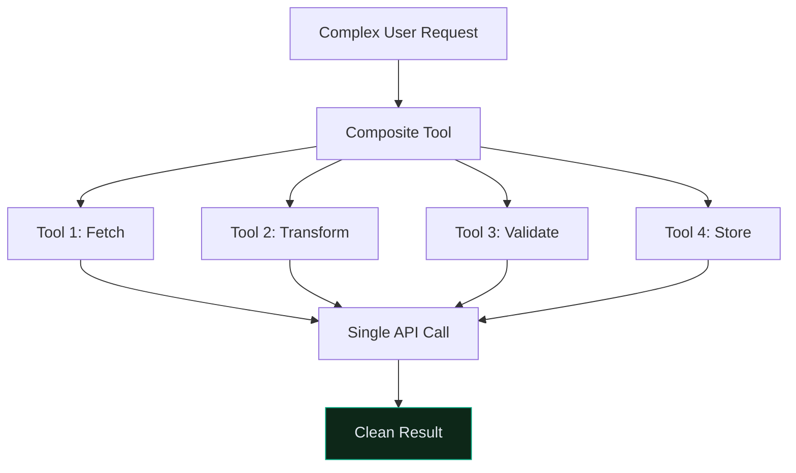
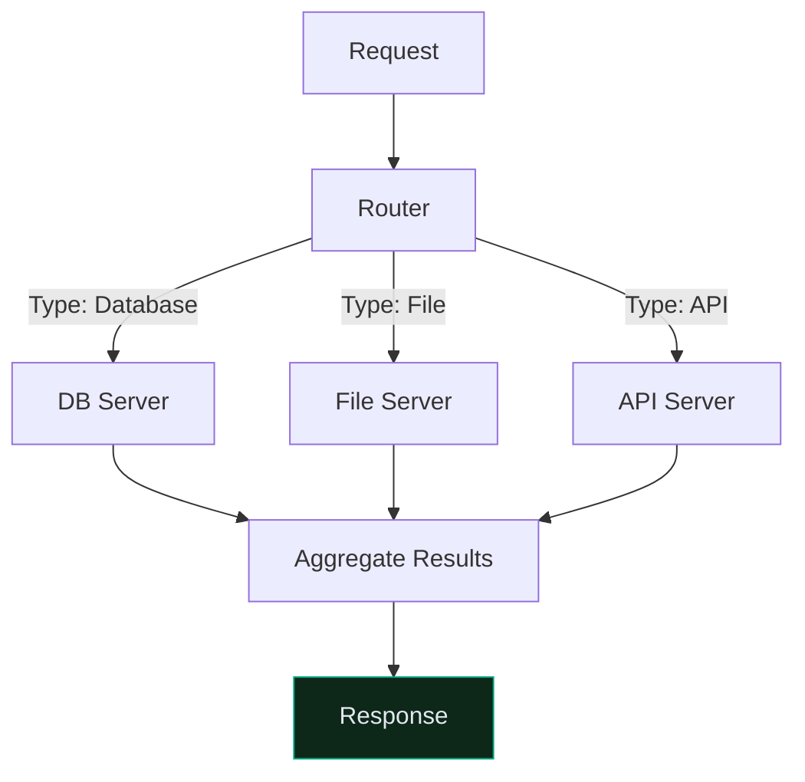

# MCP Advanced: Patterns & Production

## Table of Contents

1. [Advanced Tool Patterns](#advanced-tool-patterns)
2. [Custom Transports](#custom-transports)
3. [Resource Streaming](#resource-streaming)
4. [Prompt Composition](#prompt-composition)
5. [Error Handling & Resilience](#error-handling-resilience)
6. [Performance Optimization](#performance-optimization)
7. [Security Best Practices](#security-best-practices)
8. [Multi-Server Orchestration](#multi-server-orchestration)
9. [Testing & Debugging](#testing-debugging)
10. [Production Deployment](#production-deployment)

---

## Advanced Tool Patterns

### Tool Composition (Combining Multiple Operations)



```python
from mcp.server import Server
from pydantic import Field
import json

server = Server("composite-tools")

@server.tool()
def process_user_batch(
    user_ids: list = Field(description="List of user IDs to process"),
    action: str = Field(description="Action: analyze, transform, or validate"),
) -> dict:
    """Process multiple users in single operation.
    
    Internally composes fetch → transform → validate → store sequence.
    """
    results = []
    
    for user_id in user_ids:
        # Compose multiple internal operations
        user_data = fetch_user(user_id)
        transformed = transform_user_data(user_data, action)
        validated = validate_data(transformed)
        
        results.append({
            "user_id": user_id,
            "status": "success",
            "data": validated
        })
    
    return {
        "total_processed": len(user_ids),
        "results": results
    }

def fetch_user(user_id: str) -> dict:
    """Fetch user from database."""
    return {"id": user_id, "name": "User"}

def transform_user_data(data: dict, action: str) -> dict:
    """Transform based on action."""
    if action == "analyze":
        data["analysis"] = compute_analysis(data)
    return data

def compute_analysis(data: dict) -> dict:
    return {"score": 85, "insights": ["active", "engaged"]}

def validate_data(data: dict) -> dict:
    """Validate transformed data."""
    return data
```

### Chained Tool Dependencies

```python
@server.tool()
def analyze_and_report(
    document_id: str = Field(description="Document to analyze"),
    include_visualization: bool = Field(description="Generate charts"),
) -> str:
    """Analyze document and optionally create report with visualizations.
    
    Claude can chain calls: analyze → generate_report → visualize
    """
    # Claude will call analyze_document first
    return f"Analyzed {document_id}"

@server.tool()
def generate_report(
    document_id: str,
    analysis_results: dict,
) -> dict:
    """Generate formatted report from analysis."""
    return {
        "document_id": document_id,
        "format": "markdown",
        "content": f"# Report for {document_id}"
    }

@server.tool()
def create_visualization(
    report_data: dict,
    chart_type: str = "bar",
) -> str:
    """Create visualization for report data."""
    return f"Chart ({chart_type}): {report_data['document_id']}"
```

---

## Custom Transports

### HTTP Transport

```python
from mcp.server.models import RequestOptions
from mcp.client.session import ClientSession
import aiohttp

async def create_http_client(server_url: str):
    """Create MCP client over HTTP instead of stdio."""
    
    async with aiohttp.ClientSession() as session:
        transport = HTTPTransport(session, server_url)
        async with ClientSession(transport) as mcp_session:
            tools = await mcp_session.list_tools()
            return tools

class HTTPTransport:
    """Custom HTTP-based MCP transport."""
    
    def __init__(self, session: aiohttp.ClientSession, base_url: str):
        self.session = session
        self.base_url = base_url
    
    async def send_request(self, method: str, params: dict):
        """Send JSON-RPC request over HTTP."""
        async with self.session.post(
            f"{self.base_url}/mcp",
            json={"jsonrpc": "2.0", "method": method, "params": params}
        ) as resp:
            return await resp.json()
```

### WebSocket Transport

```python
import asyncio
import websockets
import json

class WebSocketTransport:
    """MCP transport over WebSocket for real-time communication."""
    
    def __init__(self, uri: str):
        self.uri = uri
        self.ws = None
    
    async def connect(self):
        """Establish WebSocket connection."""
        self.ws = await websockets.connect(self.uri)
    
    async def send_request(self, request: dict) -> dict:
        """Send request and get response."""
        await self.ws.send(json.dumps(request))
        response = await self.ws.recv()
        return json.loads(response)
    
    async def close(self):
        """Close connection."""
        if self.ws:
            await self.ws.close()

# Usage
async def websocket_example():
    transport = WebSocketTransport("wss://mcp-server.example.com")
    await transport.connect()
    
    result = await transport.send_request({
        "jsonrpc": "2.0",
        "method": "tools/list",
        "id": 1
    })
    
    await transport.close()
```

---

## Resource Streaming

### Large File Streaming

```python
@server.resource(
    uri="data://large-files/{file_id}",
    name="Large File",
    mime_type="application/octet-stream"
)
def stream_large_file(file_id: str) -> str:
    """Stream large file content efficiently.
    
    Instead of loading entire file into memory, stream chunks.
    """
    file_path = f"/data/files/{file_id}"
    
    try:
        with open(file_path, 'rb') as f:
            # Read and return in chunks for efficiency
            chunks = []
            while True:
                chunk = f.read(8192)  # 8KB chunks
                if not chunk:
                    break
                chunks.append(chunk)
            
            return b''.join(chunks).decode('utf-8', errors='replace')
    except FileNotFoundError:
        raise ValueError(f"File {file_id} not found")

# Client-side streaming consumption
async def consume_streamed_resource():
    """Client consumes streamed resource efficiently."""
    result = await client.read_resource("data://large-files/report.pdf")
    
    # Process in chunks instead of loading whole file
    for chunk in result.contents[0].text.split('\n'):
        process_chunk(chunk)
```

### Dynamic Resource Generation

```python
@server.resource(
    uri="data://reports/{report_id}/snapshot",
    name="Report Snapshot",
    mime_type="application/json"
)
def generate_report_snapshot(report_id: str) -> str:
    """Generate report content on-demand when accessed.
    
    Not stored, computed fresh each time for current data.
    """
    import json
    from datetime import datetime
    
    report_data = fetch_report_from_db(report_id)
    
    snapshot = {
        "report_id": report_id,
        "generated": datetime.now().isoformat(),
        "status": report_data['status'],
        "metrics": calculate_metrics(report_data),
        "version": report_data.get('version', 1)
    }
    
    return json.dumps(snapshot, indent=2)

def fetch_report_from_db(report_id: str) -> dict:
    return {"status": "active", "data": []}

def calculate_metrics(data: dict) -> dict:
    return {"count": 100, "average": 45.2}
```

---

## Prompt Composition

### Conditional Prompts

```python
@server.prompt(
    name="analyze-with-depth",
    description="Analyze with adjustable depth level"
)
def analyze_with_depth(
    document_id: str,
    depth: str = "standard",  # minimal, standard, deep, exhaustive
) -> list:
    """Return different prompts based on depth parameter."""
    
    depth_config = {
        "minimal": {
            "sections": 2,
            "detail": "brief summary"
        },
        "standard": {
            "sections": 5,
            "detail": "moderate detail"
        },
        "deep": {
            "sections": 10,
            "detail": "comprehensive analysis"
        },
        "exhaustive": {
            "sections": 20,
            "detail": "exhaustive technical review"
        }
    }
    
    config = depth_config.get(depth, depth_config["standard"])
    
    prompt_text = f"""Analyze document '{document_id}' with {depth} depth.

Provide {config['sections']} sections with {config['detail']}:
1. Summary
2. Key findings
... (more sections based on depth)

Use read_document tool to access content first."""
    
    return [{"role": "user", "content": prompt_text}]
```

### Chain Prompts (Sequential Workflows)

```python
@server.prompt(
    name="review-and-improve",
    description="Multi-stage code review and improvement workflow"
)
def review_and_improve_chain(code_id: str) -> list:
    """Create chain of prompts for sequential analysis."""
    
    return [
        {
            "role": "user",
            "content": f"""Stage 1: Review code quality.
Use read_code tool to get code with ID '{code_id}'.
Identify issues with: readability, performance, security.
Format as structured list."""
        },
        {
            "role": "assistant",
            "content": "[This will be filled with Claude's review]"
        },
        {
            "role": "user",
            "content": """Stage 2: Based on your review, suggest improvements.
Provide refactored code for top 3 issues.
Use create_improved_code tool to save suggestions."""
        }
    ]
```

---

## Error Handling & Resilience

### Graceful Degradation

```python
@server.tool()
def robust_data_fetch(
    source_id: str = Field(description="Data source"),
    fallback: bool = Field(description="Use fallback source if fails"),
) -> dict:
    """Fetch data with fallback strategy."""
    
    try:
        # Try primary source
        return fetch_from_primary(source_id)
    except ConnectionError as e:
        if fallback:
            try:
                # Try backup source
                return fetch_from_backup(source_id)
            except Exception as backup_error:
                # Return cached data
                cached = get_cached_data(source_id)
                if cached:
                    return {
                        "data": cached,
                        "source": "cache",
                        "warning": "Using cached data"
                    }
                raise ValueError(f"All sources failed: {e}, {backup_error}")
        raise

def fetch_from_primary(source_id: str) -> dict:
    return {"source": "primary", "data": []}

def fetch_from_backup(source_id: str) -> dict:
    return {"source": "backup", "data": []}

def get_cached_data(source_id: str) -> list:
    return []
```

### Retry with Exponential Backoff

```python
import asyncio
import random

async def call_tool_with_retry(
    client,
    tool_name: str,
    tool_input: dict,
    max_retries: int = 3,
) -> dict:
    """Call tool with exponential backoff retry."""
    
    for attempt in range(max_retries):
        try:
            return await client.call_tool(tool_name, tool_input)
        except Exception as e:
            if attempt == max_retries - 1:
                raise
            
            # Exponential backoff: 1s, 2s, 4s
            wait_time = 2 ** attempt + random.random()
            await asyncio.sleep(wait_time)
            continue

# Usage
result = await call_tool_with_retry(
    client,
    "fetch_data",
    {"source_id": "123"}
)
```

---

## Performance Optimization

### Tool Caching

```python
from functools import lru_cache
from datetime import datetime, timedelta

class CachedMCPTool:
    """Tool with built-in caching."""
    
    def __init__(self):
        self.cache = {}
        self.cache_ttl = timedelta(minutes=5)
    
    async def fetch_with_cache(self, key: str) -> dict:
        """Fetch data with cache check."""
        
        # Check cache
        if key in self.cache:
            cached_value, timestamp = self.cache[key]
            if datetime.now() - timestamp < self.cache_ttl:
                return {"data": cached_value, "source": "cache"}
        
        # Not in cache or expired - fetch fresh
        fresh_data = await fetch_fresh_data(key)
        
        # Update cache
        self.cache[key] = (fresh_data, datetime.now())
        
        return {"data": fresh_data, "source": "fresh"}

async def fetch_fresh_data(key: str) -> dict:
    return {"value": "fresh"}
```

### Batch Operations

```python
@server.tool()
def batch_process_items(
    items: list = Field(description="List of items to process"),
    batch_size: int = Field(description="Items per batch", default=100),
) -> dict:
    """Process items in batches for efficiency."""
    
    results = []
    total_batches = (len(items) + batch_size - 1) // batch_size
    
    for batch_num in range(total_batches):
        start = batch_num * batch_size
        end = min(start + batch_size, len(items))
        batch = items[start:end]
        
        # Process batch
        batch_result = process_batch(batch)
        results.extend(batch_result)
    
    return {
        "total_items": len(items),
        "total_batches": total_batches,
        "batch_size": batch_size,
        "results": results
    }

def process_batch(batch: list) -> list:
    return [f"Processed: {item}" for item in batch]
```

---

## Security Best Practices

### Input Validation & Sanitization

```python
from typing import Optional
import re

@server.tool()
def safe_query_database(
    query: str = Field(description="Database query"),
    allowed_tables: list = Field(description="Permitted tables"),
) -> dict:
    """Execute database query with security checks."""
    
    # Validate query syntax
    if not validate_sql_syntax(query):
        raise ValueError("Invalid SQL syntax")
    
    # Prevent SQL injection
    sanitized = sanitize_sql(query)
    
    # Restrict to allowed tables only
    extracted_tables = extract_tables_from_query(sanitized)
    
    for table in extracted_tables:
        if table not in allowed_tables:
            raise PermissionError(f"Access to table '{table}' not allowed")
    
    # Execute safe query
    return execute_query(sanitized)

def validate_sql_syntax(query: str) -> bool:
    """Check basic SQL validity."""
    return query.strip().upper().startswith(('SELECT', 'INSERT', 'UPDATE', 'DELETE'))

def sanitize_sql(query: str) -> str:
    """Remove dangerous patterns."""
    # Remove DROP, TRUNCATE, ALTER commands
    dangerous = ['DROP', 'TRUNCATE', 'ALTER', 'EXEC', 'EXECUTE']
    for keyword in dangerous:
        if keyword in query.upper():
            raise ValueError(f"'{keyword}' not allowed")
    return query

def extract_tables_from_query(query: str) -> list:
    """Extract table names from query."""
    pattern = r'FROM\s+(\w+)|INTO\s+(\w+)'
    matches = re.findall(pattern, query, re.IGNORECASE)
    return [m[0] or m[1] for m in matches]

def execute_query(query: str) -> dict:
    return {"rows": 5, "columns": 3}
```

### Rate Limiting

```python
from collections import defaultdict
from time import time

class RateLimiter:
    """Prevent tool abuse with rate limiting."""
    
    def __init__(self, max_calls: int = 100, window: int = 60):
        self.max_calls = max_calls
        self.window = window
        self.calls = defaultdict(list)
    
    def is_allowed(self, client_id: str) -> bool:
        """Check if client is within rate limit."""
        
        now = time()
        # Remove calls outside window
        self.calls[client_id] = [
            t for t in self.calls[client_id]
            if now - t < self.window
        ]
        
        # Check limit
        if len(self.calls[client_id]) >= self.max_calls:
            return False
        
        # Record call
        self.calls[client_id].append(now)
        return True

rate_limiter = RateLimiter(max_calls=100, window=60)

@server.tool()
def rate_limited_operation(client_id: str) -> dict:
    """Operation with rate limiting."""
    
    if not rate_limiter.is_allowed(client_id):
        raise PermissionError("Rate limit exceeded. Max 100 calls/minute")
    
    return {"status": "success", "data": []}
```

---

## Multi-Server Orchestration

### Client Routing



```python
class MCPServerRouter:
    """Route tool calls across multiple MCP servers."""
    
    def __init__(self):
        self.servers = {}
    
    def register_server(self, name: str, server_path: str, server_type: str):
        """Register an MCP server."""
        self.servers[name] = {
            "path": server_path,
            "type": server_type,
            "tools": []
        }
    
    async def call_tool(self, tool_name: str, tool_input: dict) -> dict:
        """Route tool to appropriate server."""
        
        # Determine which server handles this tool
        target_server = self.determine_server(tool_name)
        
        if not target_server:
            raise ValueError(f"No server found for tool '{tool_name}'")
        
        # Call the tool on target server
        client = await self.get_client(target_server)
        return await client.call_tool(tool_name, tool_input)
    
    def determine_server(self, tool_name: str) -> Optional[str]:
        """Determine target server for tool."""
        
        tool_prefixes = {
            "db_": "database_server",
            "file_": "file_server",
            "api_": "api_server",
        }
        
        for prefix, server in tool_prefixes.items():
            if tool_name.startswith(prefix):
                return server
        
        return None
    
    async def get_client(self, server_name: str):
        """Get or create client for server."""
        # Implementation to get/create client
        pass
```

---

## Testing & Debugging

### Server Introspection

```python
@server.tool()
def introspect_server() -> dict:
    """Introspect MCP server capabilities."""
    
    return {
        "name": server.name,
        "tools": [
            {
                "name": tool.name,
                "description": tool.description,
"inputs": get_tool_schema(tool)
            }
            for tool in server.tools
        ],
        "resources": list_resources(),
        "prompts": list_prompts()
    }

def list_resources() -> list:
    return ["data://documents", "data://users"]

def list_prompts() -> list:
    return ["analyze", "format", "review"]

def get_tool_schema(tool) -> dict:
    return {"type": "object", "properties": {}}
```

### Mock Tools for Testing

```python
class MockMCPServer:
    """Mock server for testing client behavior."""
    
    def __init__(self):
        self.tools = {}
        self.call_history = []
    
    def register_mock_tool(self, name: str, response: dict):
        """Register tool that returns fixed response."""
        self.tools[name] = response
    
    async def call_tool(self, tool_name: str, tool_input: dict) -> dict:
        """Call mock tool and record."""
        self.call_history.append((tool_name, tool_input))
        
        if tool_name not in self.tools:
            raise ValueError(f"Unknown tool: {tool_name}")
        
        return self.tools[tool_name]

# Test usage
mock_server = MockMCPServer()
mock_server.register_mock_tool("get_user", {"id": "123", "name": "Test"})

result = await mock_server.call_tool("get_user", {"user_id": "123"})
assert result["name"] == "Test"
assert mock_server.call_history[0] == ("get_user", {"user_id": "123"})
```

---

## Production Deployment

### Container Support

```dockerfile
FROM python:3.11-slim

WORKDIR /app

# Copy server code
COPY mcp_server.py .
COPY requirements.txt .

# Install dependencies
RUN pip install --no-cache-dir -r requirements.txt

# Health check
HEALTHCHECK --interval=30s --timeout=10s --start-period=5s \
    CMD python -c "import requests; requests.get('http://localhost:9000/health')"

# Run server
CMD ["python", "-m", "mcp.server.stdio"]
```

### Monitoring & Observability

```python
import logging
from prometheus_client import Counter, Histogram, start_http_server
import time

# Prometheus metrics
tool_calls = Counter('mcp_tool_calls_total', 'Total tool calls', ['tool_name'])
tool_duration = Histogram('mcp_tool_duration_seconds', 'Tool execution time', ['tool_name'])
tool_errors = Counter('mcp_tool_errors_total', 'Tool errors', ['tool_name'])

# Setup logging
logging.basicConfig(
    level=logging.INFO,
    format='%(asctime)s - %(name)s - %(levelname)s - %(message)s'
)
logger = logging.getLogger(__name__)

@server.tool()
def monitored_tool(param: str) -> str:
    """Tool with comprehensive monitoring."""
    tool_name = "monitored_tool"
    start_time = time.time()
    
    try:
        logger.info(f"Tool called: {tool_name}, param: {param}")
        tool_calls.labels(tool_name=tool_name).inc()
        
        # Do work
        result = process_work(param)
        
        duration = time.time() - start_time
        tool_duration.labels(tool_name=tool_name).observe(duration)
        logger.info(f"Tool completed: {tool_name} in {duration:.2f}s")
        
        return result
    except Exception as e:
        tool_errors.labels(tool_name=tool_name).inc()
        logger.error(f"Tool failed: {tool_name}, error: {e}", exc_info=True)
        raise

def process_work(param: str) -> str:
    return f"Processed: {param}"

# Start metrics server
if __name__ == "__main__":
    start_http_server(8000)  # Prometheus metrics on :8000
    # Start MCP server
```

---

## Related Resources

- [MCP Fundamentals](./05_MCP.md)
- [Claude Code in Action](./01_Claude-Code-in-Action.md)
- [Building with the API](./04_Building-with-the-Claude-API.md)
- [Agent Skills](./07_Agent-Skills.md)
