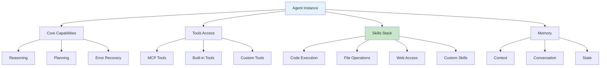
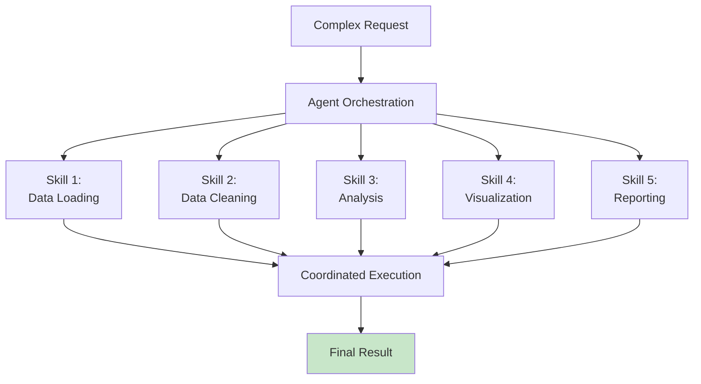

# Agent Skills: Extending Agent Capabilities

## Table of Contents
1. [Understanding Agent Skills](#understanding-agent-skills)
2. [Built-in Agent Capabilities](#built-in-agent-capabilities)
3. [Creating Custom Skills](#creating-custom-skills)
4. [Skill Composition](#skill-composition)
5. [Knowledge Files](#knowledge-files)
6. [Instruction Prompts](#instruction-prompts)
7. [Conditional Skills](#conditional-skills)
8. [Skill Performance](#skill-performance)
9. [Testing Skills](#testing-skills)
10. [Production Deployment](#production-deployment)

---

## Understanding Agent Skills

### Agent Architecture



### What Are Agent Skills?

```python
agents_skills = {
    "Definition": "Pre-packaged capabilities that extend agent functionality",
    
    "Types": {
        "Built-in": "Code execution, file I/O, web search",
        "MCP-based": "Integrated via Model Context Protocol",
        "Custom": "Domain-specific capabilities you create"
    },
    
    "Structure": {
        "instruction": "How agent should use skill",
        "tools": "List of available tools",
        "resources": "Data/files available to skill",
        "prompts": "Pre-written workflows"
    },
    
    "Benefits": {
        "Modularity": "Mix and match capabilities",
        "Reusability": "Share across multiple agents",
        "Maintainability": "Update once, affects all",
        "Specialization": "Domain-specific optimization"
    }
}
```

---

## Built-in Agent Capabilities

### Code Execution Skill

```python
# Agents can execute code in secure sandbox
code_execution_skill = {
    "name": "code_execution",
    "languages": ["python", "javascript", "bash"],
    
    "example": """
    User: "Calculate 2^10"
    Agent uses skill to execute:
    >>> print(2**10)
    1024
    """,
    
    "access": {
        "read": "files in working directory",
        "write": "temporary files",
        "execute": "safe system commands",
        "deny": "system escalation, network attacks"
    }
}

# Agent automatically uses code skill
agent_response = """
I'll calculate 2^10 for you using Python:

```python
result = 2**10
print(f"2^10 = {result}")
```

The result is 1024.
"""
```

### File Operations Skill

```python
# Agents can read/write files securely
file_operations_skill = {
    "tools": [
        "read_file: Read file contents",
        "create_file: Create new file",
        "edit_file: Modify file",
        "delete_file: Remove file",
        "list_files: Directory listing"
    ],
    
    "constraints": {
        "sandboxed": True,  # Can't access outside work dir
        "max_file_size": "100MB",
        "safe_paths": ["./work", "./data", "./output"]
    }
}

# Example: Agent modifying configuration
agent_workflow = """
1. read_file("config.yaml")
2. Parse configuration
3. Make requested changes
4. edit_file("config.yaml", old_content, new_content)
5. Confirm changes
"""
```

### Web Search Skill

```python
# Agents can search web for current information
web_search_skill = {
    "tool": "web_search",
    "capabilities": [
        "Find current information",
        "Search multiple sources",
        "Extract key facts",
        "Provide citations"
    ],
    
    "usage": """
    User: "What's the latest news on AI?"
    Agent: Uses web_search skill
    Results: Finds latest articles with sources
    Response: Summarizes with citations
    """,
    
    "best_practices": {
        "citation": "Always cite sources",
        "verification": "Cross-reference multiple sources",
        "recency": "Prefer recent information",
        "relevance": "Focus on user question"
    }
}
```

---

## Creating Custom Skills

### Skill Structure

```python
from pydantic import BaseModel
from typing import List

class AgentSkill(BaseModel):
    """Define custom agent skill."""
    
    name: str                      # Unique skill identifier
    description: str               # What it does
    instruction: str               # How agent should use it
    tools: List[str]              # Required MCP/built-in tools
    resources: List[str]          # Data sources available
    prompts: List[str]            # Pre-written workflows
    constraints: dict             # Usage limits
    metadata: dict                # Custom data

# Example: Custom data analysis skill
data_analysis_skill = AgentSkill(
    name="data_analysis",
    description="Analyze datasets using statistical methods",
    instruction="""When asked to analyze data:
    1. Load the dataset using read_dataset tool
    2. Compute descriptive statistics
    3. Create visualizations
    4. Provide insights and recommendations
    5. Save results to output directory""",
    tools=["read_dataset", "create_visualization", "compute_stats"],
    resources=["datasets/*", "templates/*"],
    prompts=["analyze_numerical", "analyze_categorical"],
    constraints={
        "max_dataset_size": "1GB",
        "timeout": 300,
        "output_formats": ["json", "csv", "pdf"]
    },
    metadata={"version": "1.0", "author": "data-team"}
)
```

### Implementing Custom Skills

```python
from anthropic import Anthropic

class DataAnalysisAgent:
    """Agent with custom data analysis skill."""
    
    def __init__(self):
        self.client = Anthropic()
        self.skill = data_analysis_skill
    
    def analyze_dataset(self, dataset_path: str, analysis_type: str) -> dict:
        """Use skill to analyze dataset."""
        
        # Build system prompt with skill instructions
        system_prompt = f"""You are a data analysis expert.

Your skills:
- {self.skill.description}

When analyzing data:
{self.skill.instruction}

Available tools: {', '.join(self.skill.tools)}"""
        
        # Request analysis
        response = self.client.messages.create(
            model="claude-3-opus-20240229",
            max_tokens=4096,
            system=system_prompt,
            messages=[{
                "role": "user",
                "content": f"""Analyze the dataset at {dataset_path}
                Analysis type: {analysis_type}
                Focus on: {analysis_type}_analysis"""
            }]
        )
        
        return {
            "analysis": response.content[0].text,
            "skill_used": self.skill.name,
            "tokens_used": response.usage.output_tokens
        }

# Usage
agent = DataAnalysisAgent()
result = agent.analyze_dataset("data/sales.csv", "numerical")
```

---

## Skill Composition

### Combining Multiple Skills



```python
class MultiSkillAgent:
    """Agent combining multiple specialized skills."""
    
    def __init__(self):
        self.skills = {
            "data_loading": data_loading_skill,
            "data_cleaning": data_cleaning_skill,
            "analysis": analysis_skill,
            "visualization": visualization_skill,
            "reporting": reporting_skill
        }
        self.client = Anthropic()
    
    def execute_workflow(self, user_request: str) -> dict:
        """Execute multi-skill workflow."""
        
        # Build skill registry
        skill_registry = self._build_skill_registry()
        
        # Create orchestration prompt
        system = f"""You are a data analysis orchestrator with these skills:
        
{skill_registry}

Choose the right skill sequence to accomplish the task.
Execute skills in order, passing results between them."""
        
        # Execute workflow
        messages = [{"role": "user", "content": user_request}]
        
        response = self.client.messages.create(
            model="claude-3-opus-20240229",
            max_tokens=4096,
            system=system,
            messages=messages
        )
        
        return {
            "result": response.content[0].text,
            "skills_available": list(self.skills.keys())
        }
    
    def _build_skill_registry(self) -> str:
        """Build human-readable skill registry."""
        registry = []
        for name, skill in self.skills.items():
            registry.append(f"- {name}: {skill.description}")
        return "\n".join(registry)
```

---

## Knowledge Files

### Attaching Knowledge

```python
from pathlib import Path

class KnowledgeFile:
    """Domain knowledge attached to agent."""
    
    def __init__(self, path: str, format: str = "text"):
        self.path = Path(path)
        self.format = format
        self.content = self._load()
    
    def _load(self) -> str:
        """Load knowledge file."""
        if self.format == "text":
            return self.path.read_text()
        elif self.format == "markdown":
            # Parse markdown structure
            return self._parse_markdown()
        elif self.format == "json":
            import json
            return json.dumps(json.loads(self.path.read_text()), indent=2)
        else:
            raise ValueError(f"Unknown format: {self.format}")
    
    def _parse_markdown(self) -> str:
        """Extract key sections from markdown."""
        content = self.path.read_text()
        # Extract headers and key content
        return content

class KnowledgableAgent:
    """Agent with attached knowledge files."""
    
    def __init__(self, knowledge_files: List[str]):
        self.knowledge = {}
        for file_path in knowledge_files:
            name = Path(file_path).stem
            self.knowledge[name] = KnowledgeFile(file_path)
        self.client = Anthropic()
    
    def query_with_knowledge(self, question: str) -> str:
        """Answer question using knowledge files."""
        
        # Build knowledge context
        knowledge_context = "\n\n".join([
            f"# {name}\n{knowledge.content}"
            for name, knowledge in self.knowledge.items()
        ])
        
        system = f"""You are an expert assistant with deep knowledge in the following:

{knowledge_context}

Use this knowledge to answer questions accurately."""
        
        response = self.client.messages.create(
            model="claude-3-opus-20240229",
            max_tokens=2048,
            system=system,
            messages=[{"role": "user", "content": question}]
        )
        
        return response.content[0].text

# Usage
agent = KnowledgableAgent([
    "knowledge/company_policies.md",
    "knowledge/technical_specs.md",
    "knowledge/best_practices.md"
])

answer = agent.query_with_knowledge("What's our policy on remote work?")
```

---

## Instruction Prompts

### Custom Instructions

```python
agent_instructions = {
    "tone": "Professional but friendly",
    
    "communication": [
        "Explain technical concepts simply",
        "Always provide examples",
        "Ask clarifying questions if needed"
    ],
    
    "constraints": [
        "NEVER share sensitive data",
        "ALWAYS cite sources",
        "Test code before suggesting"
    ],
    
    "preferences": [
        "Prefer Python for examples",
        "Use clear variable names",
        "Include error handling"
    ],
    
    "expertise_areas": [
        "Python, TypeScript, Go",
        "System design, databases",
        "Machine learning, NLP"
    ]
}

class CustomInstructionAgent:
    """Agent following custom instructions."""
    
    def __init__(self, instructions: dict):
        self.instructions = instructions
        self.client = Anthropic()
    
    def _build_system_prompt(self) -> str:
        """Build system prompt from instructions."""
        
        lines = []
        lines.append("You are a sophisticated AI assistant.")
        
        # Tone
        if "tone" in self.instructions:
            lines.append(f"Tone: {self.instructions['tone']}")
        
        # Communication style
        if "communication" in self.instructions:
            lines.append("\nCommunication guidelines:")
            for item in self.instructions["communication"]:
                lines.append(f"- {item}")
        
        # Constraints
        if "constraints" in self.instructions:
            lines.append("\nImportant constraints:")
            for item in self.instructions["constraints"]:
                lines.append(f"- {item}")
        
        return "\n".join(lines)
    
    def chat(self, user_message: str) -> str:
        """Chat with custom instructions."""
        
        response = self.client.messages.create(
            model="claude-3-opus-20240229",
            max_tokens=2048,
            system=self._build_system_prompt(),
            messages=[{"role": "user", "content": user_message}]
        )
        
        return response.content[0].text

# Usage
agent = CustomInstructionAgent(agent_instructions)
response = agent.chat("How do I implement pagination in Django?")
```

---

## Conditional Skills

### Skills Based on Context

```python
class ContextAwareAgent:
    """Agent that selects skills based on context."""
    
    def __init__(self):
        self.client = Anthropic()
        self.skill_scorer = SkillScorer()
    
    def select_skills(self, user_query: str) -> List[str]:
        """Intelligently select skills for query."""
        
        # Analyze query
        analysis = self._analyze_query(user_query)
        
        # Score available skills
        skill_scores = {}
        for skill_name, skill in self.available_skills.items():
            score = self.skill_scorer.score(skill, analysis)
            skill_scores[skill_name] = score
        
        # Select top-scoring skills
        selected = sorted(
            skill_scores.items(),
            key=lambda x: x[1],
            reverse=True
        )[:3]  # Top 3 skills
        
        return [name for name, score in selected]
    
    def _analyze_query(self, query: str) -> dict:
        """Analyze query to extract intent and context."""
        return {
            "keywords": extract_keywords(query),
            "intent": detect_intent(query),
            "domain": detect_domain(query),
            "complexity": estimate_complexity(query)
        }

def extract_keywords(query: str) -> list:
    return query.lower().split()

def detect_intent(query: str) -> str:
    intents = {
        "analyze": ["analyze", "examine", "study"],
        "create": ["create", "generate", "build"],
        "modify": ["change", "update", "fix"],
        "explain": ["explain", "why", "how does"]
    }
    for intent, keywords in intents.items():
        if any(kw in query.lower() for kw in keywords):
            return intent
    return "general"

def detect_domain(query: str) -> str:
    if any(word in query.lower() for word in ["data", "analyze", "graph"]):
        return "data"
    return "general"

def estimate_complexity(query: str) -> str:
    if len(query) > 100:
        return "high"
    return "medium" if len(query) > 50 else "low"
```

---

## Skill Performance

### Monitoring Skill Usage

```python
from dataclasses import dataclass
from datetime import datetime
from collections import defaultdict

@dataclass
class SkillMetrics:
    """Track skill performance."""
    name: str
    calls: int = 0
    success: int = 0
    failures: int = 0
    total_time: float = 0.0
    avg_tokens: float = 0.0
    
    @property
    def success_rate(self) -> float:
        if self.calls == 0:
            return 0.0
        return self.success / self.calls
    
    @property
    def avg_time(self) -> float:
        if self.calls == 0:
            return 0.0
        return self.total_time / self.calls

class SkillMonitor:
    """Monitor and optimize skill performance."""
    
    def __init__(self):
        self.metrics = defaultdict(lambda: SkillMetrics(""))
    
    def record_skill_use(
        self,
        skill_name: str,
        success: bool,
        execution_time: float,
        tokens_used: int
    ):
        """Record skill execution metrics."""
        metric = self.metrics[skill_name]
        metric.name = skill_name
        metric.calls += 1
        
        if success:
            metric.success += 1
        else:
            metric.failures += 1
        
        metric.total_time += execution_time
        metric.avg_tokens = (metric.avg_tokens * (metric.calls - 1) + tokens_used) / metric.calls
    
    def get_report(self) -> dict:
        """Get performance report."""
        return {
            "skills": {
                name: {
                    "calls": m.calls,
                    "success_rate": f"{m.success_rate:.1%}",
                    "avg_time": f"{m.avg_time:.2f}s",
                    "avg_tokens": f"{m.avg_tokens:.0f}"
                }
                for name, m in self.metrics.items()
            }
        }

# Usage
monitor = SkillMonitor()
monitor.record_skill_use("data_analysis", True, 2.5, 1200)
monitor.record_skill_use("data_analysis", True, 2.3, 1100)
report = monitor.get_report()
print(report)
```

---

## Testing Skills

### Skill Validation

```python
from typing import Callable

class SkillTest:
    """Test individual skill execution."""
    
    def __init__(self, skill_name: str, test_func: Callable):
        self.skill_name = skill_name
        self.test_func = test_func
    
    async def run(self) -> dict:
        """Run test and return results."""
        try:
            result = await self.test_func()
            return {
                "skill": self.skill_name,
                "status": "passed",
                "result": result
            }
        except Exception as e:
            return {
                "skill": self.skill_name,
                "status": "failed",
                "error": str(e)
            }

# Example tests
async def test_data_analysis():
    """Test data analysis skill."""
    agent = DataAnalysisAgent()
    result = agent.analyze_dataset("test_data.csv", "numerical")
    assert "statistics" in result["analysis"].lower()
    return result

async def test_code_execution():
    """Test code execution skill."""
    agent = CodeAgent()
    result = agent.execute_code("print(2+2)")
    assert "4" in result
    return result

# Run tests
import asyncio

async def run_skill_tests():
    """Run all skill tests."""
    tests = [
        SkillTest("data_analysis", test_data_analysis),
        SkillTest("code_execution", test_code_execution),
    ]
    
    results = []
    for test in tests:
        result = await test.run()
        results.append(result)
    
    return results

# results = asyncio.run(run_skill_tests())
```

---

## Production Deployment

### Skill Versioning

```python
class SkillVersion:
    """Manage skill versions."""
    
    def __init__(self, name: str, version: str):
        self.name = name
        self.version = version
        self.created_at = datetime.now()
    
    def is_compatible(self, required_version: str) -> bool:
        """Check version compatibility."""
        # Semantic versioning: major.minor.patch
        v_major, v_minor, v_patch = map(int, self.version.split('.'))
        r_major, r_minor, r_patch = map(int, required_version.split('.'))
        
        # Compatible if major.minor matches
        return v_major == r_major and v_minor >= r_minor

class SkillRegistry:
    """Central skill version management."""
    
    def __init__(self):
        self.skills = {}
    
    def register(self, skill: SkillVersion):
        """Register skill version."""
        key = f"{skill.name}:{skill.version}"
        self.skills[key] = skill
    
    def get_compatible(self, skill_name: str, version: str) -> SkillVersion:
        """Get compatible skill version."""
        for key, skill in self.skills.items():
            if skill.name == skill_name and skill.is_compatible(version):
                return skill
        raise ValueError(f"No compatible version of {skill_name}")
```

---

## Best Practices

### ✅ Do
- Keep skills focused and single-purpose
- Document skill requirements and constraints
- Test skills before production
- Monitor skill performance
- Version skills properly
- Provide clear error messages

### ❌ Don't
- Create overly complex skills
- Mix business logic across skills
- Deploy untested skills
- Ignore performance degradation
- Share secrets in prompts
- Assuming skill always succeeds

---

## Related Resources
- [Agent Architecture](./01_Claude-Code-in-Action.md)
- [MCP Integration](./05_MCP.md)
- [Advanced MCP](./06_MCP-Advanded.md)
- [Subagents](./08_Subagents.md)
