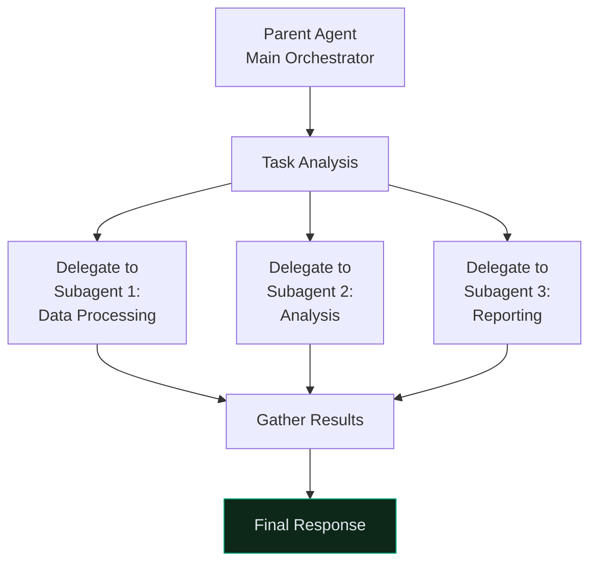
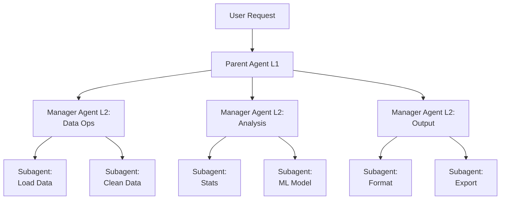
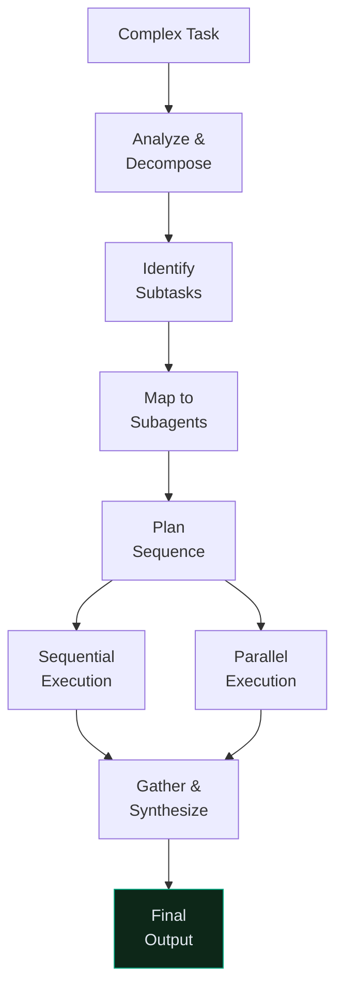
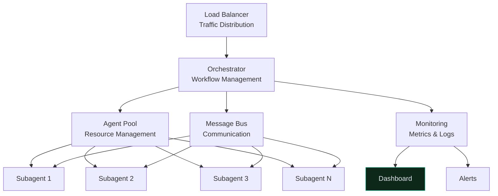

# Subagents: Delegation & Coordination

## Table of Contents

- [Subagents: Delegation \& Coordination](#subagents-delegation--coordination)
  - [Table of Contents](#table-of-contents)
  - [Subagent Fundamentals](#subagent-fundamentals)
    - [What Are Subagents?](#what-are-subagents)
    - [When to Use Subagents](#when-to-use-subagents)
  - [Architecture Patterns](#architecture-patterns)
    - [Hierarchical Structure](#hierarchical-structure)
    - [Flat Team Structure](#flat-team-structure)
  - [Creating Subagents](#creating-subagents)
    - [Subagent Blueprint](#subagent-blueprint)
  - [Delegation Strategies](#delegation-strategies)
    - [Task Decomposition](#task-decomposition)
    - [Load Balancing](#load-balancing)
  - [Orchestration Patterns](#orchestration-patterns)
    - [Sequential Pipeline](#sequential-pipeline)
    - [Parallel Processing](#parallel-processing)
  - [Communication Protocols](#communication-protocols)
    - [Message Format](#message-format)
  - [Error Handling](#error-handling)
    - [Graceful Failure](#graceful-failure)
  - [Scaling Subagents](#scaling-subagents)
    - [Dynamic Creation](#dynamic-creation)
  - [Testing \& Monitoring](#testing--monitoring)
    - [Subagent Testing](#subagent-testing)
  - [Production Systems](#production-systems)
    - [System Architecture](#system-architecture)
    - [Configuration Management](#configuration-management)
  - [Related Resources](#related-resources)

---

## Subagent Fundamentals

### What Are Subagents?

**Subagents** = specialized agent instances created and coordinated by a parent agent to handle subtasks.



### When to Use Subagents

```python
use_cases = {
    "✅ Use Subagents": [
        "Complex task breaks into independent subtasks",
        "Need specialized agents for different domains",
        "Tasks can execute in parallel",
        "Want encapsulation and reusability",
        "Need separate error handling per subtask",
    ],
    
    "❌ Don't Use Subagents": [
        "Single linear task (overhead > benefit)",
        "Tight coupling between steps (complex sync)",
        "Limited resources (memory/latency constraints)",
        "Simple prompt modification suffices",
        "Real-time response critical"
    ]
}

decision_tree = """
Is task complex? 
  ├─ Yes: Can it break into independent subtasks?
  │       ├─ Yes: Use SUBAGENTS → Benefit from parallelism
  │       └─ No: Use SINGLE AGENT with multi-step prompts
  └─ No: Use SINGLE AGENT (simpler/faster)
"""
```

---

## Architecture Patterns

### Hierarchical Structure



### Flat Team Structure

```python
class FlatSubagentTeam:
    """Multiple subagents coordinated by parent."""
    
    def __init__(self):
        self.parent = ParentAgent()
        self.subagents = {
            "data_ingestion": DataIngestionAgent(),
            "cleaning": DataCleaningAgent(),
            "analysis": AnalysisAgent(),
            "visualization": VisualizationAgent(),
        }
    
    async def process_task(self, task: dict) -> dict:
        """Process task with parallel subagents."""
        
        # Parent determines workflow
        workflow = self.parent.plan_workflow(task)
        
        # Execute subagents in parallel where possible
        results = {}
        
        for stage, subagent_names in workflow.items():
            tasks = [
                self.subagents[name].execute(task, stage)
                for name in subagent_names
            ]
            
            # Run in parallel
            results[stage] = await asyncio.gather(*tasks)
        
        return results

class ParentAgent:
    def plan_workflow(self, task: dict) -> dict:
        """Determine execution sequence."""
        return {
            "stage_1": ["data_ingestion"],
            "stage_2": ["cleaning"],
            "stage_3": ["analysis", "visualization"],  # Parallel
        }

class DataIngestionAgent:
    async def execute(self, task: dict, stage: str) -> dict:
        return {"loaded": "data"}

class DataCleaningAgent:
    async def execute(self, task: dict, stage: str) -> dict:
        return {"cleaned": "data"}

class AnalysisAgent:
    async def execute(self, task: dict, stage: str) -> dict:
        return {"analysis": "results"}

class VisualizationAgent:
    async def execute(self, task: dict, stage: str) -> dict:
        return {"visualization": "charts"}
```

---

## Creating Subagents

### Subagent Blueprint

```python
from typing import Optional

class SubagentConfig:
    """Configuration for subagent creation."""
    
    def __init__(
        self,
        name: str,
        role: str,
        responsibilities: list,
        tools: list,
        max_tokens: int = 2048,
        temperature: float = 0.3,
    ):
        self.name = name
        self.role = role
        self.responsibilities = responsibilities
        self.tools = tools
        self.max_tokens = max_tokens
        self.temperature = temperature

class Subagent:
    """Specialized agent instance."""
    
    def __init__(self, config: SubagentConfig, parent_context=None):
        self.config = config
        self.parent_context = parent_context
        self.client = Anthropic()
        self.execution_history = []
    
    def build_system_prompt(self) -> str:
        """Build specialized system prompt."""
        
        responsibilities = "\n".join(
            [f"- {r}" for r in self.config.responsibilities]
        )
        
        return f"""You are {self.config.name}, a specialized {self.config.role}.

Your responsibilities:
{responsibilities}

Available tools: {', '.join(self.config.tools)}

Focus solely on your assigned task.
Ask for clarification if needed.
Report results clearly and concisely."""
    
    async def execute(self, task: dict, context: Optional[dict] = None) -> dict:
        """Execute subtask."""
        
        # Build context from parent
        context_str = ""
        if context:
            context_str = f"\n\nContext from parent agent:\n{context}"
        
        response = self.client.messages.create(
            model="claude-3-opus-20240229",
            max_tokens=self.config.max_tokens,
            temperature=self.config.temperature,
            system=self.build_system_prompt(),
            messages=[{
                "role": "user",
                "content": f"Task: {task}\n{context_str}"
            }]
        )
        
        result = response.content[0].text
        
        # Record execution
        self.execution_history.append({
            "task": task,
            "result": result,
            "tokens": response.usage.output_tokens
        })
        
        return {
            "subagent": self.config.name,
            "task": task,
            "result": result,
            "success": response.stop_reason == "end_turn"
        }

# Create specialized subagents
data_agent_config = SubagentConfig(
    name="DataSpecialist",
    role="data engineer",
    responsibilities=[
        "Load and parse datasets",
        "Validate data integrity",
        "Handle missing values",
        "Format for analysis"
    ],
    tools=["read_file", "execute_code", "query_database"]
)

analysis_agent_config = SubagentConfig(
    name="AnalystPro",
    role="data analyst",
    responsibilities=[
        "Perform statistical analysis",
        "Identify patterns",
        "Test hypotheses",
        "Generate insights"
    ],
    tools=["execute_code", "create_visualization"]
)

# Create instances
data_agent = Subagent(data_agent_config)
analysis_agent = Subagent(analysis_agent_config)
```

---

## Delegation Strategies

### Task Decomposition



```python
class TaskDecomposer:
    """Decompose complex tasks for subagents."""
    
    def decompose(self, task: str, subagent_specs: dict) -> dict:
        """Break task into subtasks."""
        
        decomposition_plan = {
            "task": task,
            "subtasks": [],
            "dependencies": [],
            "execution_strategy": ""
        }
        
        # Use Claude to analyze
        response = self.client.messages.create(
            model="claude-3-opus-20240229",
            max_tokens=2048,
            messages=[{
                "role": "user",
                "content": f"""Analyze this task and decompose it for {len(subagent_specs)} specialized subagents:

Task: {task}

Available subagents:
{self._format_subagents(subagent_specs)}

Return a JSON plan with:
1. subtasks: List of atomic tasks
2. assignments: Which subagent for each
3. dependencies: Which tasks depend on others
4. strategy: "sequential" or "parallel"
5. reasoning: Why this decomposition"""
            }]
        )
        
        # Parse response to get plan
        plan_text = response.content[0].text
        return self._parse_plan(plan_text)
    
    def _format_subagents(self, specs: dict) -> str:
        return "\n".join([
            f"- {name}: {spec['role']}"
            for name, spec in specs.items()
        ])
    
    def _parse_plan(self, plan_text: str) -> dict:
        # Parse JSON from Claude response
        import json
        import re
        match = re.search(r'\{.*\}', plan_text, re.DOTALL)
        if match:
            return json.loads(match.group())
        return {}
```

### Load Balancing

```python
class LoadBalancer:
    """Distribute work across subagents efficiently."""
    
    def __init__(self, subagents: dict):
        self.subagents = subagents
        self.loads = {name: 0 for name in subagents}
        self.completed = {name: 0 for name in subagents}
    
    def assign_task(self, task: dict) -> str:
        """Assign task to least-loaded subagent."""
        
        # Find subagent with lowest load
        min_load_agent = min(self.loads.items(), key=lambda x: x[1])
        agent_name = min_load_agent[0]
        
        # Update load
        estimated_tokens = len(task.get("content", "")) // 4
        self.loads[agent_name] += estimated_tokens
        
        return agent_name
    
    def complete_task(self, agent_name: str, tokens_used: int):
        """Mark task as completed."""
        self.loads[agent_name] -= tokens_used
        self.completed[agent_name] += 1
    
    def get_stats(self) -> dict:
        """Get load balancing statistics."""
        return {
            "current_loads": self.loads,
            "completed_per_agent": self.completed,
            "efficiency": sum(self.completed.values()) / sum(self.loads.values() + [1])
        }
```

---

## Orchestration Patterns

### Sequential Pipeline

```python
class SequentialOrchestrator:
    """Run subagents in sequence."""
    
    def __init__(self, subagents: dict):
        self.subagents = subagents
    
    async def execute_pipeline(
        self,
        task: str,
        pipeline: list,  # ["agent1", "agent2", "agent3"]
    ) -> dict:
        """Execute subagents in sequence."""
        
        context = {"original_task": task}
        results = {}
        
        for agent_name in pipeline:
            print(f"Executing: {agent_name}")
            
            # Pass context to subagent
            result = await self.subagents[agent_name].execute(
                task,
                context=str(context)
            )
            
            results[agent_name] = result
            
            # Update context with result
            context[f"{agent_name}_output"] = result["result"]
        
        return {
            "pipeline": pipeline,
            "results": results,
            "final_context": context
        }

# Usage
orchestrator = SequentialOrchestrator({
    "data_load": data_loader_agent,
    "processing": data_processor_agent,
    "analysis": analysis_agent,
})

result = asyncio.run(orchestrator.execute_pipeline(
    "Analyze Q3 sales data",
    pipeline=["data_load", "processing", "analysis"]
))
```

### Parallel Processing

```python
class ParallelOrchestrator:
    """Run independent subagents in parallel."""
    
    def __init__(self, subagents: dict):
        self.subagents = subagents
    
    async def execute_parallel(
        self,
        tasks: dict,  # {"agent1": task1, "agent2": task2}
    ) -> dict:
        """Execute multiple subagents in parallel."""
        
        # Create tasks for each subagent
        execution_tasks = [
            self.subagents[agent_name].execute(task)
            for agent_name, task in tasks.items()
        ]
        
        # Run all in parallel
        results = await asyncio.gather(*execution_tasks)
        
        # Map results back
        return {
            agent_name: result
            for (agent_name, _), result in zip(tasks.items(), results)
        }

# Usage
orchestrator = ParallelOrchestrator({
    "reports": report_agent,
    "analysis": analysis_agent,
    "visualization": viz_agent,
})

results = asyncio.run(orchestrator.execute_parallel({
    "reports": "Generate Q3 report",
    "analysis": "Analyze Q3 trends",
    "visualization": "Create Q3 dashboards"
}))
```

---

## Communication Protocols

### Message Format

```python
from dataclasses import dataclass
from typing import Any

@dataclass
class AgentMessage:
    """Standardized message between agents."""
    
    sender: str
    receiver: str
    message_type: str  # "task", "result", "error", "status"
    content: Any
    timestamp: datetime
    trace_id: str  # For tracking
    
    def to_dict(self) -> dict:
        return {
            "sender": self.sender,
            "receiver": self.receiver,
            "type": self.message_type,
            "content": self.content,
            "timestamp": self.timestamp.isoformat(),
            "trace_id": self.trace_id
        }

class MessageBus:
    """Central message routing for subagents."""
    
    def __init__(self):
        self.messages = []
        self.subscribers = defaultdict(list)
    
    def publish(self, message: AgentMessage):
        """Publish message."""
        self.messages.append(message)
        
        # Notify subscribers
        for callback in self.subscribers[message.receiver]:
            callback(message)
    
    def subscribe(self, agent_name: str, callback):
        """Subscribe to messages."""
        self.subscribers[agent_name].append(callback)
    
    def get_history(self, trace_id: str) -> list:
        """Get all messages for a trace."""
        return [m for m in self.messages if m.trace_id == trace_id]
```

---

## Error Handling

### Graceful Failure

```python
class ResilientSubagentExecutor:
    """Execute with automatic retry and fallback."""
    
    def __init__(self, subagent: Subagent, max_retries: int = 3):
        self.subagent = subagent
        self.max_retries = max_retries
    
    async def execute_with_recovery(
        self,
        task: dict,
        fallback_agent: Optional[Subagent] = None,
    ) -> dict:
        """Execute with error recovery."""
        
        for attempt in range(self.max_retries):
            try:
                result = await self.subagent.execute(task)
                if result["success"]:
                    return result
            except Exception as e:
                if attempt == self.max_retries - 1:
                    # Last attempt failed
                    if fallback_agent:
                        return await fallback_agent.execute(task)
                    else:
                        return {
                            "success": False,
                            "error": str(e),
                            "subagent": self.subagent.config.name
                        }
                
                # Retry after backoff
                wait_time = 2 ** attempt
                await asyncio.sleep(wait_time)
        
        return {"success": False, "error": "Max retries exceeded"}
```

---

## Scaling Subagents

### Dynamic Creation

```python
class SubagentPool:
    """Pool of reusable subagent instances."""
    
    def __init__(self, template_configs: dict, max_pool_size: int = 10):
        self.template_configs = template_configs
        self.max_pool_size = max_pool_size
        self.pool = defaultdict(list)
        self.active_agents = defaultdict(int)
    
    async def get_agent(self, agent_type: str) -> Subagent:
        """Get or create subagent from pool."""
        
        # Return existing if available
        if self.pool[agent_type]:
            return self.pool[agent_type].pop()
        
        # Create new if under limit
        if self.active_agents[agent_type] < self.max_pool_size:
            config = self.template_configs[agent_type]
            agent = Subagent(config)
            self.active_agents[agent_type] += 1
            return agent
        
        # Wait for available
        while not self.pool[agent_type]:
            await asyncio.sleep(0.1)
        
        return self.pool[agent_type].pop()
    
    def return_agent(self, agent_type: str, agent: Subagent):
        """Return agent to pool."""
        self.pool[agent_type].append(agent)

# Usage
pool = SubagentPool({
    "data_handler": data_config,
    "analyzer": analysis_config,
}, max_pool_size=5)

# Dynamically get agents
agent = await pool.get_agent("data_handler")
result = await agent.execute(task)
pool.return_agent("data_handler", agent)
```

---

## Testing & Monitoring

### Subagent Testing

```python
class SubagentTester:
    """Test subagent behavior."""
    
    def __init__(self, subagent: Subagent):
        self.subagent = subagent
        self.test_results = []
    
    async def run_tests(self, test_cases: list) -> dict:
        """Run test suite."""
        
        passed = 0
        failed = 0
        
        for test_case in test_cases:
            try:
                result = await self.subagent.execute(test_case["task"])
                
                # Check expectations
                if self._verify_result(result, test_case["expected"]):
                    passed += 1
                else:
                    failed += 1
                    print(f"Failed: {test_case['name']}")
            except Exception as e:
                failed += 1
                print(f"Error in {test_case['name']}: {e}")
        
        return {
            "total": len(test_cases),
            "passed": passed,
            "failed": failed,
            "success_rate": passed / len(test_cases)
        }
    
    def _verify_result(self, result: dict, expected: dict) -> bool:
        """Verify result matches expectations."""
        return (
            result.get("success") == expected.get("success") and
            expected.get("contains", "") in result.get("result", "")
        )

# Usage
tester = SubagentTester(analysis_agent)
results = asyncio.run(tester.run_tests([
    {
        "name": "basic_analysis",
        "task": {"data": [1, 2, 3, 4, 5]},
        "expected": {"success": True, "contains": "average"}
    },
    {
        "name": "error_handling",
        "task": {"data": None},
        "expected": {"success": False}
    }
]))

print(f"Success rate: {results['success_rate']:.1%}")
```

---

## Production Systems

### System Architecture



### Configuration Management

```python
from pydantic import BaseSettings

class ProductionConfig(BaseSettings):
    """Production configuration."""
    
    # Pool settings
    max_agents_per_type: int = 10
    min_agents_per_type: int = 2
    
    # Timeouts
    task_timeout: int = 300  # seconds
    agent_timeout: int = 60
    
    # Retry strategy
    max_retries: int = 3
    backoff_factor: float = 2.0
    
    # Monitoring
    enable_metrics: bool = True
    log_level: str = "INFO"
    
    # Resource limits
    max_memory_per_agent: str = "2GB"
    max_tokens_per_task: int = 4096
    
    class Config:
        env_file = ".env.production"

config = ProductionConfig()

# Apply configuration
pool = SubagentPool(
    template_configs,
    max_pool_size=config.max_agents_per_type
)
```

---

## Related Resources

- [Agent Skills](./07_Agent-Skills.md)
- [MCP Advanced](./06_MCP-Advanded.md)
- [Claude Code in Action](./01_Claude-Code-in-Action.md)
- [Building with the API](./04_Building-with-the-Claude-API.md)
