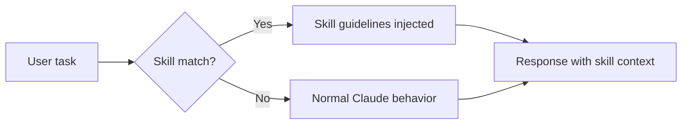
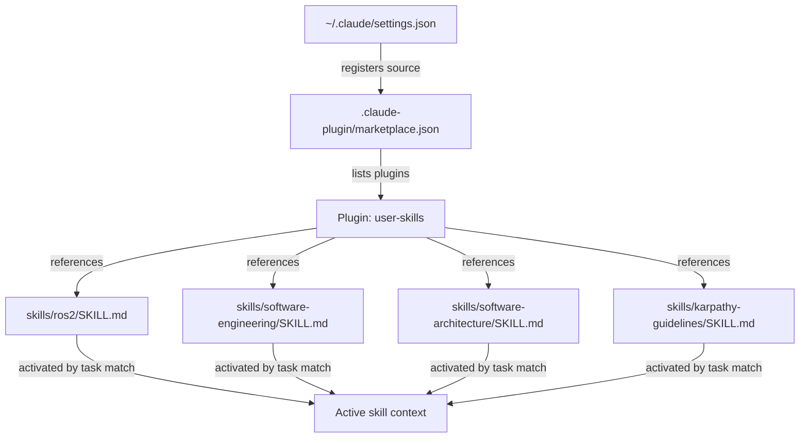

# Claude Code Skills

## Table of contents

1. [What are skills](#what-are-skills)
2. [How skills trigger](#how-skills-trigger)
3. [The SKILL.md format](#the-skillmd-format)
4. [The marketplace system](#the-marketplace-system)
5. [Skills in this project](#skills-in-this-project)
6. [Adding a new skill](#adding-a-new-skill)
7. [Writing effective skill descriptions](#writing-effective-skill-descriptions)
8. [Best practices](#best-practices)

---

## What are skills

Skills are reusable behavioral modules for Claude Code. A skill is a markdown file (`SKILL.md`) that contains guidelines Claude follows when a matching task is in scope. Skills do not add tools or external integrations — they shape how Claude reasons and responds within its existing capabilities.

Unlike a `CLAUDE.md` file (which is always active for a project), skills activate selectively based on the current task. A ROS2 skill fires when you are working on robot middleware code; a software architecture skill fires when you are designing systems. Unrelated work is unaffected.



Skills are distributed through a **marketplace** — a local or remote catalog of available skills. The Claude Code harness reads the marketplace, makes skills available, and handles triggering automatically.

---

## How skills trigger

Each skill has a `description` field in its YAML frontmatter. Claude Code's harness compares the current task against all enabled skill descriptions and injects the matching skill's content as behavioral context.

The description is the trigger mechanism. It must precisely name the conditions under which the skill applies. Vague descriptions cause the skill to fire too broadly or not at all.

**Examples of tight descriptions:**

- `Use when working with ROS2 nodes, packages, launch files, rclpy/rclcpp code...`
- `Use when designing APIs or interfaces, deciding on module/package structure...`
- `Use when writing, reviewing, or refactoring code to avoid overcomplication...`

Multiple skills can be active simultaneously if the task matches more than one description.

---

## The SKILL.md format

A skill file has two parts: a YAML frontmatter block and a markdown body.

```markdown
---
name: my-skill
description: One or two sentences describing exactly when this skill should activate. Be specific about the signals — file types, task types, domain concepts.
---

# Skill title

Body content: guidelines, rules, patterns, examples, tables.
Claude will follow this content when the skill is active.
```

### Frontmatter fields

| Field | Required | Purpose |
|-------|----------|---------|
| `name` | Yes | Unique identifier for the skill within its marketplace |
| `description` | Yes | Trigger condition — this is what the harness matches against |
| `license` | No | Optional license declaration |

### Body content

The body is free-form markdown. Write it as direct behavioral instructions. Use headings to organize topic areas, tables for decision matrices, and code blocks for patterns. Keep it actionable — Claude will follow these guidelines verbatim when the skill is active, so every section should say what to do, not just what to know.

---

## The marketplace system

Skills are grouped into **plugins** inside a **marketplace**. The marketplace is defined by a `marketplace.json` file.

### marketplace.json structure

```json
{
  "name": "user-skills",
  "owner": {
    "name": "Your Name"
  },
  "metadata": {
    "description": "Short description of this marketplace",
    "version": "1.0.0"
  },
  "plugins": [
    {
      "name": "user-skills",
      "description": "What these skills cover",
      "source": "./",
      "strict": false,
      "skills": [
        "./skills/my-skill-a",
        "./skills/my-skill-b"
      ]
    }
  ]
}
```

Each entry in `skills` is a path to a directory containing a `SKILL.md` file.

### How the harness finds the marketplace

`~/.claude/settings.json` registers marketplace sources and enables specific plugins:

```json
{
  "skills": {
    "sources": [
      {
        "type": "directory",
        "path": "/path/to/your/project"
      }
    ],
    "enabled": [
      "user-skills@user-skills"
    ]
  }
}
```

The `enabled` value uses the format `<marketplace-name>@<plugin-name>`.



---

## Skills in this project

This project ships four skills. They are defined in `skills/` and registered in `.claude-plugin/marketplace.json`.

### ros2

**Path:** `skills/ros2/SKILL.md`

Covers opinionated guidelines for writing production-quality ROS2 code in Python (`rclpy`) and C++ (`rclcpp`). Activates when working with ROS2 nodes, packages, launch files, `CMakeLists.txt` with ament, `package.xml`, colcon builds, topics, services, actions, QoS settings, lifecycle nodes, and TF2 transforms.

Key areas: node design, communication pattern selection (topic vs service vs action), QoS profile matching, executor patterns, parameter declaration, Python launch files, package organization, build and test workflow, TF2 usage, error handling, C++ idioms, and naming conventions.

### software-engineering

**Path:** `skills/software-engineering/SKILL.md`

Covers practical engineering guidelines for decisions that affect API shape, module structure, error handling strategy, design pattern selection, and cross-file contracts. Activates when designing APIs or interfaces, planning error handling, choosing between patterns, writing production code across multiple files, or when code organization decisions affect more than one file.

Key areas: API and interface design principles, error handling philosophy (programming errors vs domain errors vs infrastructure errors), module organization by domain, when to reach for design patterns, testing strategy (unit vs integration vs end-to-end), structured observability, and dependency management.

### software-architecture

**Path:** `skills/software-architecture/SKILL.md`

Covers structural thinking for systems that need to evolve, scale, and be operated. Activates when designing new systems or subsystems, choosing architectural patterns (microservices, event-driven, hexagonal, CQRS), defining component or service boundaries, planning integration strategies, writing Architecture Decision Records (ADRs), evaluating technology stack choices, or reasoning about non-functional requirements.

Key areas: the three questions architecture must answer, boundary heuristics, pattern selection (monolith vs microservices vs event-driven vs hexagonal vs CQRS), quality attribute tradeoffs, ADR format and storage, coupling and cohesion, data flow ownership, designing for operations, and a structured evaluation framework for comparing options.

### karpathy-guidelines

**Path:** `skills/karpathy-guidelines/SKILL.md`

Behavioral guidelines derived from Andrej Karpathy's observations on common LLM coding mistakes. Activates when writing, reviewing, or refactoring code to avoid overcomplication, make surgical changes, surface assumptions, and define verifiable success criteria.

Key areas: think before coding (surface assumptions, ask when unclear), simplicity first (minimum code that solves the problem), surgical changes (touch only what the task requires), and goal-driven execution (define verifiable success criteria before starting).

---

## Adding a new skill

Adding a skill to this project takes two steps.

### Step 1: create the skill directory and SKILL.md

```bash
mkdir skills/my-new-skill
```

Create `skills/my-new-skill/SKILL.md`:

```markdown
---
name: my-new-skill
description: Precise description of when this skill should activate. Name specific file types, frameworks, task types, or domain concepts that signal relevance.
---

# My new skill

## Section one

Guidelines for the first topic area.

## Section two

Guidelines for the second topic area.
```

### Step 2: register it in marketplace.json

Open `.claude-plugin/marketplace.json` and add the path to the `skills` array:

```json
{
  "plugins": [
    {
      "name": "user-skills",
      "skills": [
        "./skills/karpathy-guidelines",
        "./skills/ros2",
        "./skills/software-engineering",
        "./skills/software-architecture",
        "./skills/my-new-skill"
      ]
    }
  ]
}
```

That is all. Claude Code will pick up the new skill on the next session start.

---

## Writing effective skill descriptions

The `description` field is the most important part of a skill. It is the only signal the harness uses to decide whether to activate the skill. A bad description means the skill never fires, fires constantly, or fires at the wrong time.

### Describe signals, not topics

Name the concrete signals that indicate the skill is relevant. File names, framework identifiers, task verbs, and domain nouns are all good signals. Abstract topic names are not.

| Weak | Strong |
|------|--------|
| "Software development" | "Use when designing APIs or interfaces, deciding on module/package structure..." |
| "Robotics" | "Use when working with ROS2 nodes, packages, launch files, rclpy/rclcpp code, CMakeLists.txt with ament..." |
| "Code quality" | "Use when writing, reviewing, or refactoring code to avoid overcomplication, make surgical changes..." |

### Be specific about task types

Name the task verbs that should trigger the skill: *designing*, *reviewing*, *debugging*, *choosing between*, *writing production code across multiple files*. This prevents the skill from activating on shallow mentions of the domain.

### Cover the full signal surface

List enough signals that a task in scope will match. A ROS2 skill that only mentions "ROS2 nodes" will miss tasks involving "launch files" or "colcon builds". Cover the realistic range of entry points into that domain.

### Avoid overlap with always-on context

Skills work alongside `CLAUDE.md`. Do not duplicate project-level context in a skill description. Skills are for domain-specific behavioral modes, not for project facts.

---

## Best practices

### Skill content

- Write instructions, not explanations. Each section should say what to do.
- Use tables for decision matrices (when to use X vs Y).
- Include code patterns where the correct form is non-obvious.
- Keep the file focused. One responsibility per skill.
- Name tradeoffs explicitly. A guideline without its tradeoff is incomplete.

### Skill organization

- One directory per skill. Do not put multiple skills in one `SKILL.md`.
- Name directories to match the `name` frontmatter field.
- Group related skills in the same plugin within `marketplace.json`.

### Skill maintenance

- Update descriptions when the domain grows. If the skill now covers new frameworks or file types, add them to the description.
- Version `marketplace.json` with the rest of the project. Skill changes are code changes.
- Test a new skill by running a task that should trigger it and confirming the behavior changed as expected.

---

## Related resources

- [Claude Code in Action](./01_Claude-Code-in-Action.md)
- [Agent Skills reference](./07_Agent-Skills.md)
- [MCP integration](./05_MCP.md)
