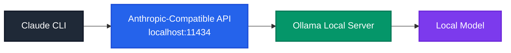

# Claude-Ollama-Coder

> Use the **Claude CLI** with **local models served by Ollama**.

This setup redirects the Anthropic-compatible endpoint used by Claude CLI to a **local Ollama server**, so you can keep the Claude CLI workflow while running open models on your own machine.

## Why this exists

This is useful when you want:

* local LLM inference
* Claude CLI workflow
* coding models such as **Qwen3-Coder** or **GPT-OSS**
* no external API dependency for requests

## Quick Start

### 1. Start Ollama

```bash
ollama serve
```

### 2. Pull a model

```bash
ollama pull qwen3-coder
```

### 3. Configure Claude CLI

Set the API endpoint to your local Ollama server:

```bash
export ANTHROPIC_API_KEY=sk-dummy
export ANTHROPIC_API_URL=http://localhost:11434/v1
```

### 4. Use Claude CLI

```bash
claude -p <prompt-or-path>
```

## Architecture

Claude CLI normally talks to Anthropic's API, but in this setup you point it at **Ollama running on `localhost:11434`** instead.

The key difference: Claude CLI still thinks it is using an Anthropic-style API, but the actual model is local.



## Documentation

Explore the documentation to learn more about:

- **Claude Code in Action** - Real-world examples and use cases
- **Claude 101** - Fundamentals of working with Claude
- **AI Fluency Framework** - Understanding AI models and their capabilities
- **Building with the Claude API** - How to integrate Claude into your applications
- **MCP** - Model Context Protocol for seamless integrations

## Requirements

* **Ollama** installed and running
* **Claude CLI** installed
* at least one model available in Ollama, such as:
  * `qwen3-coder`
  * `gpt-oss:120b-cloud`
  * `deepseek-coder`

## Features

- ✅ Full Claude CLI compatibility
- ✅ Run models locally with Ollama
- ✅ No external API costs
- ✅ Complete privacy - all inference runs on your machine
- ✅ Support for multiple model families

---

For more information and troubleshooting, check the documentation sections.
