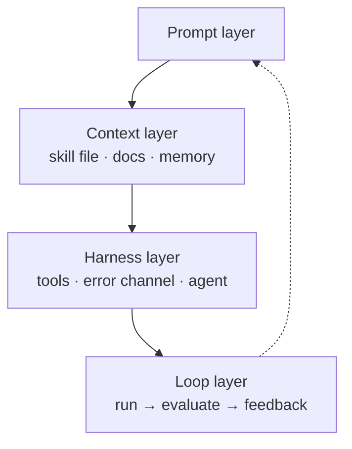

# Layer Explorer (placeholder)

Save the interactive page Claude built in Stage 2 here (e.g. `layer-explorer.html`).

```mermaid
flowchart TB
    P[Prompt layer] --> C[Context layer<br/>skill file · docs · memory]
    C --> H[Harness layer<br/>tools · error channel · agent]
    H --> L[Loop layer<br/>run → evaluate → feedback]
    L -.-> P
```
